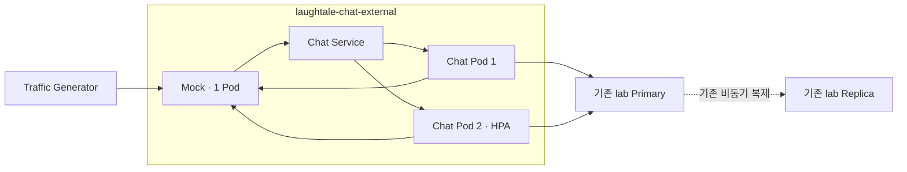

# 외부 대화 K8s 실험 · G4

Status: staged · 2026-09-08. manifest 준비와 `kubectl kustomize` 렌더만 확인했습니다.
**실기동·이미지 빌드·HPA·롤링 배포는 미검증입니다.** 기본 replicas0이고 HPA는 base에 포함하지 않습니다.
Chat/Mock의 명시적인 `isolated-lab` 설정을 manifest에 반영했습니다. 기본 로컬 loopback 보호는 유지합니다.
Pod 간 통신의 실제 실행·검증은 아래 조건을 확인한 뒤 root가 수행합니다.
업무 범위와 통과 조건의 정본은 [현재 task](../../../tasks/chat-external-platforms.md)입니다.

## 실험 경계



머신 간 또는 다중 node 고가용성이 아닙니다. k3d의 node1개에서 **외부 메시지 machine API와 DB 작업**을 시험합니다.
브라우저 세션은 프로세스 메모리에 있어 Pod 간 공유되지 않습니다. Pod2개가 Ready라는 사실로
사용자 로그인·WS fan-out·세션 복구 HA가 검증됐다고 설명하지 않습니다. 이 실험에서는 사용자 cookie에 의존하지 않습니다.
Mock은 단일 Pod·인메모리 원장이므로 실험 중 교체하지 않고 종료 전에 원장을 export합니다.

## 시작 전 코드·설정 체크리스트

- [x] Chat `NETWORK_PROFILE=isolated-lab`, `APP_ENVIRONMENT=isolated-lab`, Mock `MOCK_NETWORK_PROFILE=isolated-lab`을 명시합니다. 기본 로컬 mode의 loopback·Origin 보호는 유지합니다.
- [ ] lab mode에서 지정한 `0.0.0.0` bind, Service authority만 허용하고 Pod source CIDR `10.42.0.0/24`를 검증합니다. 실제 CIDR이 바뀌면 재조회합니다.
- [ ] Chat은 `/v1/external-events` 등 필요한 machine API만 제공합니다. 임의 Host·Forwarded·Origin·다른 연결 credential·무인증 요청을 거절하는 negative test가 있습니다.
- [ ] Mock URL은 `http://platform-mock:18087`, callback은 `http://chat:18082`로 명시적으로 allowlist합니다. 요청 URL·외부 hostname·환경 proxy·redirect는 허용하지 않습니다.
- [x] runtime settings의 lab profile 필드명을 확인하고 비밀이 아닌 설정을 manifest env에 반영했습니다. credential은 Secret에만 둡니다.
- [ ] Chat1→2개에서 inbox 멱등성·발신 lease/claim·재시작 unknown 처리의 실제 DB 테스트가 통과했습니다.
- [ ] startup은 migration/seed를 실행하지 않습니다. root가 기존 DB에 적용된 revision과 합성 연결만 확인합니다.
- [ ] NetworkPolicy가 현재 CNI에서 실제 적용되는지 허용·차단 요청을 각각 검사합니다. YAML 존재는 격리 증거가 아닙니다.

## 자원 예산

| 대상 | replicas | requests CPU / memory | limits CPU / memory |
| --- | --- | --- | --- |
| Chat | 1→2 | Pod당100m / 128Mi | 300m / 256Mi |
| Mock | 1 | 100m / 96Mi | 300m / 192Mi |
| Chat rollout surge | 최대1 | 100m / 128Mi | 300m / 256Mi |

Chat2+Mock의 steady requests352Mi, rollout peak480Mi입니다. limits는704Mi/960Mi이며 **reservation이나 실사용량이 아닙니다**.
관측 당시 node allocatable 약1.6GiB·현재 사용815Mi이므로 여유를 보장하지 않습니다. root가 시작 직전에 다시 확인하고
MemoryPressure·OOM·지속 throttling 발생 시 부하를 중단합니다. 다른 프로젝트를 내려 여유를 만들지 않습니다.
부하 발생기는 우선 host에서 실행하거나 exec로 허용된 Pod에서 소량 확인합니다. 별도 generator Pod 추가 시 예산을 재계산합니다.
DB pool은 Chat Pod당2, steady4/rollout6입니다. 기존 DB의 다른 연결까지 더해 max_connections30과 대조합니다.

HPA는 CPU requests 대비60%, min1/max2, scale-up30초에1개·scale-down 안정화120초입니다.
CPU 기반 HPA가 DB·I/O 병목을 해결하지는 않습니다. 실제 증가를 못 관측하면 자동 확장 검증은 미완료입니다.
`maxSurge=1/maxUnavailable=0`, readiness, preStop5초와 grace30초를 제공합니다. preStop sleep은 트래픽 drain handshake가 아니며,
PDB minAvailable1은 voluntary eviction 제약이지 직접 Pod 삭제·node 장애·Deployment 업데이트의 무중단 보장이 아닙니다.

## DB 접근 · 기존 Docker lab 유지

2026-09-08 읽기 확인:

| 대상 | Docker network | 컨테이너 IP / port | host 공개 |
| --- | --- | --- | --- |
| Primary | `laughtale-postgres-lab_default` | `172.22.0.2:5432` | `127.0.0.1:5440` |
| Replica | 동일 | `172.22.0.3:5432` | `127.0.0.1:5441` |
| k3d node | `k3d-laughtale-local`만 연결 | `172.20.0.3` | 기존 설정 |

Pod에서 `127.0.0.1:5440`은 DB가 아닙니다. `host.k3d.internal` 이름만 바꿔도 host loopback이 열리지 않습니다.
root가 **기존 k3d node만 lab Docker network에 추가 연결**하면 DB 컨테이너 IP:5432에 직접 접근하는 경로를 시험할 수 있습니다.
host 포트·공유 DB·DB 서비스·HBA는 변경하지 않습니다. 기존 lab HBA는 지정 DB의 writer/reader를 SCRAM으로 허용합니다.
이 network 연결이 Pod 라우팅/SNAT까지 보장하는 것은 아니므로 TCP와 실제 인증 SQL을 각각 검증해야 합니다.

```sh
docker inspect k3d-laughtale-local-server-0 --format '{{json .NetworkSettings.Networks}}'
docker inspect laughtale-postgres-lab-primary-1 --format '{{json .NetworkSettings.Networks}}'
docker inspect laughtale-postgres-lab-replica-1 --format '{{json .NetworkSettings.Networks}}'
# Root가 해당 node가 아직 미연결임을 확인한 경우에만 실행합니다.
docker network connect laughtale-postgres-lab_default k3d-laughtale-local-server-0
```

Docker alias는 Pod DNS에 자동 등록되지 않습니다. `database.yaml`은 selector 없는 Service와 수동 EndpointSlice로
`chat-primary:5432`/`chat-replica:5432`를 가리킵니다. IP는 위 관측값이므로 재기동 때 재확인하고 `network.yaml`의 /32도 같이 맞춥니다.
Chat `DB_PRIMARY_URL`은 writer 계정·기존 `laughtale_chat` DB·`chat-primary:5432`를 사용합니다.
Replica Service는 읽기 검증용이며 서비스가 Replica read routing을 구현했다고 주장하지 않습니다.

## E1 성장 시험 추가 구성

현재 API manifest는 `external-lab-v8`과 별도 `chat-growth-env` Secret을 참조합니다.
아래 초기 v1 설치 예시는 이 추가 구성을 대신하지 않습니다. 기존 실행 환경에 base를
재적용하면 replicas 0으로 바뀌므로, 실행 중에는 대상 Deployment만 변경합니다.

`prepare-ingress-secret.py`는 `.artifacts/chat-distributed/secrets/ingress.env`를 0600으로
최초 생성하며 기존 파일은 덮어쓰지 않습니다. 이 파일의 `LAB_INGRESS_TOKEN`을
`chat-growth-env` Secret으로 생성하고, `lab_proxy.py`를 `chat-growth-proxy-source`
ConfigMap으로 생성합니다. API에는 `LAB_INGRESS_ENABLED=true`, Secret 참조,
Downward API `metadata.uid`를 읽는 `LAB_POD_UID`가 필요합니다.

`growth-proxy.yaml`은 별도 실험용 fixture입니다. 기본 kustomization에 넣지 않습니다.
API v8 rollout을 먼저 마치고 API 1개 기준선을 준비한 뒤 proxy를 배포합니다.
Proxy를 포함해 API 2개가 되면 namespace의 Pod 9개 상한에 도달하므로 추가 rollout은
surge 여유를 먼저 확인합니다. Proxy는 localhost port-forward 18096만 진입점으로
쓰고 `chat:18082` Service만 호출합니다. 외부 노출·세션 발급·WS 라우팅은 제공하지 않습니다.
Proxy의 `/health/ready`는 프로세스 생존만 뜻하며 실제 API 접근은 시험 사전검사가 확인합니다.

실행·증거·제약은 [E1 시험 안내](../../../tests/system/chat-distributed/GROWTH.md)에 있습니다.

## Root 실행 순서

모든 명령은 repo root 기준이며 적용은 root가 수행합니다. 현재 단계에서는 렌더만 완료했습니다.

```sh
kubectl --context k3d-laughtale-local get nodes
kubectl --context k3d-laughtale-local top nodes
kubectl kustomize infra/k8s/chat-external
```

설정 조건과 DB 접근을 해결한 뒤 root가 이미지를 빌드·import합니다. Dockerfile은 whitelist context와
명시 COPY로 소스·공통 계약·lock만 가져오고 환경 파일·tests·cache는 포함하지 않습니다. Python tag 가용성·lock 빌드는 이 단계에서 확인합니다.

```sh
docker build -f infra/k8s/chat-external/Dockerfile --build-arg SERVICE=chat -t laughtale-chat:external-lab-v1 .
docker build -f infra/k8s/chat-external/Dockerfile --build-arg SERVICE=platform-mock -t laughtale-platform-mock:external-lab-v1 .
k3d image import laughtale-chat:external-lab-v1 laughtale-platform-mock:external-lab-v1 --cluster laughtale-local
kubectl --context k3d-laughtale-local apply -k infra/k8s/chat-external
```

Secret을 커밋하지 않습니다. root가 `infra/k8s/chat-external/.env.chat`과 `.env.mock`을600권한으로 준비하고
실제 값은 출력하지 않습니다. Chat env는 DB_PRIMARY_URL·EXTERNAL_CONTROL_TOKEN·EXTERNAL_CONNECTION_CREDENTIALS·
MOCK_API_TOKEN·기능 opt-in 및 확정된 lab mode/allowlist 값을 포함합니다. Mock env는 MOCK_CONTROL_TOKEN·
MOCK_SERVICE_TOKEN·MOCK_CONNECTION_TOKENS 및 확정된 lab mode/allowlist 값입니다. 제어·발신·연결 토큰을 분리합니다.

```sh
kubectl --context k3d-laughtale-local -n laughtale-chat-external create secret generic chat-lab-env --from-env-file=infra/k8s/chat-external/.env.chat
kubectl --context k3d-laughtale-local -n laughtale-chat-external create secret generic platform-mock-lab-env --from-env-file=infra/k8s/chat-external/.env.mock
kubectl --context k3d-laughtale-local -n laughtale-chat-external scale deployment/chat deployment/platform-mock --replicas=1
kubectl --context k3d-laughtale-local -n laughtale-chat-external rollout status deployment/chat --timeout=120s
kubectl --context k3d-laughtale-local -n laughtale-chat-external rollout status deployment/platform-mock --timeout=120s
```

처음1 Pod 왕복/대사 확인 → 명시2 Pod machine API 중복/lease 확인 → HPA 순입니다.

```sh
kubectl --context k3d-laughtale-local -n laughtale-chat-external scale deployment/chat --replicas=2
kubectl --context k3d-laughtale-local -n laughtale-chat-external rollout status deployment/chat --timeout=120s
# machine API 검증 후1개로 복귀하여 HPA 증가를 별도로 관측합니다.
kubectl --context k3d-laughtale-local -n laughtale-chat-external scale deployment/chat --replicas=1
kubectl --context k3d-laughtale-local apply -f infra/k8s/chat-external/hpa.yaml
kubectl --context k3d-laughtale-local -n laughtale-chat-external get hpa,pods
```

HPA 동작 후 base를 재적용하면 replicas0을 다시 쓰므로 하지 않습니다. 재배포 전 HPA 제어와 manifest replicas 소유권을 정합니다.
롤링 시험은 Mock을 유지하고 Chat만 수행하며 입력 이벤트·실제 효과·시도·DB 저장을 대사합니다.
Mock port-forward는 제어 편의이지 Service 부하 분산 검증이 아닙니다. user cookie/WS 무중단은 이번 증거에서 제외합니다.

## 종료

발생기를 먼저 멈추고 pending/active0 및 원장 수집을 확인한 뒤 아래 **전용 namespace만** 삭제합니다.
Mock 원장은 Pod 삭제 시 복구할 수 없으며 기존 DB·volume·다른 namespace는 삭제하지 않습니다.

```sh
kubectl --context k3d-laughtale-local delete namespace laughtale-chat-external
# Root가 이 실험에서 node network 연결을 추가했고 더 이상 소비자가 없음을 확인한 경우에만 실행합니다.
docker network disconnect laughtale-postgres-lab_default k3d-laughtale-local-server-0
```

근거: [Kubernetes HPA](https://kubernetes.io/docs/concepts/workloads/autoscaling/horizontal-pod-autoscale/),
[NetworkPolicy](https://kubernetes.io/docs/concepts/services-networking/network-policies/),
[selector 없는 Service](https://kubernetes.io/docs/concepts/services-networking/service/#services-without-selectors).
공식 설명을 참고한 설정안이며 실제 CNI·Metrics API·DB 경로 검증을 대체하지 않습니다.
