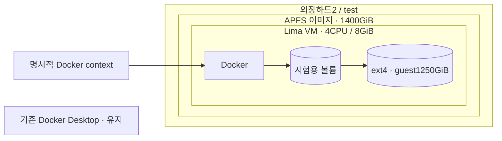
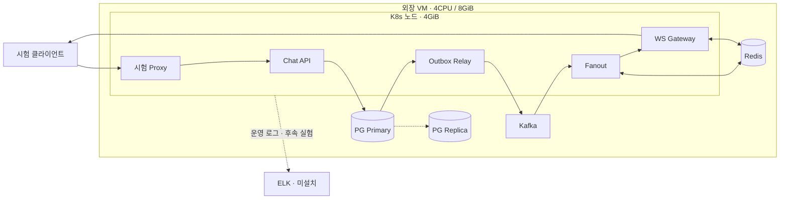

# 외장 저장소 시험 환경

Status: 이미지1400GiB/guest1250GiB 확장·K8s·DB 복제·20건 E2E 연결 검증 완료 · 2026-09-09.
1억 건 누적 및 최대 지속 처리량 시험은 아직 수행하지 않았습니다. 현재 환경을 성능 통과로 해석하지 않습니다.
활성 작업과 승인 범위는 [채팅 task](../../tasks/linky-chat-internal-dm.md)의 M2가 소유합니다.



## 준비한 것과 현재 상태

| 항목 | 상태 |
| --- | --- |
| 외장 대상 | `/Volumes/외장하드2/test`, ExFAT, 약1.8TiB 여유 |
| 새 이미지 | `laughtale-capacity.sparsebundle`, APFS, 논리1400GiB로 resize exit0 |
| 이미지 실제 사용량 | 생성 직후 약30MiB 증가입니다. 200GiB를 미리 채우지 않습니다. |
| 새 APFS 볼륨 | `LaughtaleLab`, UUID `42866728-DFAB-4FE4-A3DB-993A506E5F66` |
| 검증 | 새 이미지 fsck_apfs 읽기 검사 exit0, 정상 표시 |
| 실패 | 일반 attach/읽기전용 mount 실패. Disk Arbitration mount status `0x42` |
| 관리자 재시도 | 사용자가 sudo attach를 실행해 정상 마운트했습니다. UUID·사용자 쓰기 권한 확인을 통과했습니다. |
| 파일 검증 | 64MiB 쓰기·fsync·재열기 SHA256 비교 통과입니다. 임시 검증 파일만 자동 제거합니다. |
| VM / Docker 엔진 | VZ/ARM64, CPU4, RAM8GiB, Docker29.8.0, overlayfs입니다. |
| guest 저장소 | `/dev/vda1`, ext4, 약1.2TiB입니다. `/var/lib/docker`도 같은 장치이며 GPT 검증 오류0입니다. |
| 재시작 검증 | Docker named volume의1MiB 파일이 VM 정상 stop/start 후 동일 SHA256으로 보존됐습니다. |
| 기존 환경 | 기본 context는 `desktop-linux` 그대로이며 기존 VM·컨테이너를 재시작하거나 삭제하지 않았습니다. |

마운트 실패의 근본 원인은 아직 미확정입니다. 검사 통과만으로 실제 쓰기 안정성·전원 단절 내구성을 보장하지 않습니다.
초기 실패 후 이미지를 정상 detach했고, 이후 사용자 관리자 마운트로 진행을 재개했습니다.

## 관리자 마운트 재시도

이미지를 분리·재연결할 때의 절차입니다. 마운트된 상태에서 VM만 stop/start할 때는 다시 attach하지 않습니다.
로그인 자동 마운트나 비밀번호 없는 sudo 규칙은 구성하지 않았습니다.

macOS 터미널에서 아래 명령을 실행합니다. 비밀번호는 터미널의 sudo 프롬프트에만 입력합니다.
외장하드 포맷이나 기존 데이터 이동 명령이 아닙니다.

```sh
sudo hdiutil attach '/Volumes/외장하드2/test/laughtale-capacity.sparsebundle' -nobrowse -owners on
```

이후 `/Volumes/LaughtaleLab`이 실제로 마운트됐는지 확인합니다. 실패하면 추가 이미지·포맷으로 반복하지 않고 오류를 진단합니다.
관리자로 마운트했을 때 owner가 root라면 필요한 새 `lima` 디렉터리의 소유권만 별도로 확인합니다.
`sudo limactl`이나 외장 전체 재귀 chmod/chown은 하지 않습니다.

## 기동과 검증 순서

```sh
python3 infra/lima/capacity.py check
python3 infra/lima/storage_probe.py
python3 infra/lima/capacity.py create
python3 infra/lima/capacity.py start
python3 infra/lima/capacity.py status
```

도우미는 물리 외장 볼륨과 APFS 이미지 UUID·마운트 경로를 먼저 검사합니다. 마운트가 없을 때
호스트 디스크에 같은 이름의 폴더를 만들고 진행하지 않습니다. 이미지 재생성으로 UUID가 바뀌면 재검토합니다.
Lima2.2.0 공식 docker-rootful template과 [capacity.yaml](capacity.yaml)을 사용합니다.
CPU4/RAM8GiB/guest disk1250GiB 설정이며 `--mount-none`으로 호스트 홈 공유를 제거합니다.
일반 TCP/UDP 자동 전달을 차단하며 관리용 SSH와 Docker Unix socket, 명시한 loopback26447(K8s API)만 사용합니다.
Docker socket은 기본 template에서 한 번만 상속합니다. 중복 선언하면 host socket 연결이 실패했습니다.
기존 Docker context는 전환하지 않습니다.
기동 전후 memory_pressure free15% 및 외장 free200GiB 기준은 작업자가 확인합니다. 자동 메모리 감시기는 아직 없습니다.
이번 기동 후 호스트 memory_pressure free48%였습니다. 이는 부하 중 메모리 여유를 보장하지 않습니다.
Lima의 이미지 다운로드·변환 캐시는 기본 macOS 캐시 경로를 사용합니다. VM 운영 디스크와 메타데이터는 외장에 둡니다.

기동 뒤 확인할 항목:

- guest의 실제 CPU/RAM/디스크·파일시스템, 컨테이너 데이터의 외장 이미지 경로 추적입니다.
- 새 Docker context의 명시적 선택과 기존 context 불변입니다.
- bounded 파일 쓰기·fsync·재읽기 hash, VM 정상 재시작 뒤 데이터 보존입니다.
- 실제 처리율은 별도 부하 시험에서 측정합니다. 이 환경 준비를 1천만 건 처리 완료로 세지 않습니다.

## Docker 사용과 재검증

생성된 context는 `lima-laughtale-capacity`입니다. 아래처럼 항상 명시합니다.

```sh
docker --context lima-laughtale-capacity info
docker --context lima-laughtale-capacity compose -f infra/lima/storage-probe.compose.yaml run --rm storage-probe
python3 infra/lima/capacity.py stop
python3 infra/lima/capacity.py start
# 재시작 후에는 파일을 생성하지 않는 읽기 검증만 수행합니다.
docker --context lima-laughtale-capacity compose -f infra/lima/storage-probe.compose.yaml run --rm storage-probe sh -ec 'cd /evidence; sha256sum -c SHA256SUMS; sha256sum probe.bin'
```

전후 SHA256: `1c4f53116f1d6d5528ce6093840736a25794cfd63bc2691f1985b908d4455053`.
검증 컨테이너는 종료 후 제거하며 `laughtale-capacity-probe_evidence` 볼륨의 작은 증거 파일은 보존합니다.
정상 종료 재시작만 시험했습니다. USB 단절·강제 전원 종료 복구 시험은 아닙니다.

## 새 시험 클러스터 · 현재 검증 범위



- `laughtale-capacity` 전용 Docker network(172.28.0.0/24)와 독립 데이터 볼륨을 사용합니다.
- [capacity.compose.yaml](capacity.compose.yaml)이 PG Primary/Replica, Kafka, Redis의 정확한 예산을 소유합니다.
  PG2벌 각768MiB, Kafka1GiB, Redis192MiB, K8s node4GiB 제한입니다. 메모리 실제 사용과 상한을 혼동하지 않습니다.
- Replica는 streaming/async, recovery=true, replay pause=false입니다. Primary와 Replica의 max_connections를60으로 맞췄습니다.
  기존 replica script는 설정 가능한 값을 추가했지만 기본30/64MB는 유지해 기존 환경의 동작을 바꾸지 않습니다.
- Kafka는 단일 broker/RF1/4 partition으로 HA가 아닙니다. 장기 검증 증거를 삭제하지 않도록 retention을 해제했습니다.
  디스크 중단 가드가 완성되기 전에는 대량 전송하지 않습니다.
- API/Relay/Fanout/Gateway/시험 Proxy 각각1개가 Running/Ready이며 기동 후 재시작0입니다.
  Metrics API 조회가 동작합니다. HPA·다중 머신·최대 처리량은 미검증입니다.
- API→DB→Outbox→Kafka→WS20건이 일치했습니다.
  [원시 결과](../../.artifacts/chat-capacity/smoke-6ff85337-aaef-4b35-94a7-48af48b240c6.json)는 본문·token을 포함하지 않습니다.
- 초기 k3d 생성 실패로 데이터가 없는 새 클러스터만 재생성했습니다. DB·Kafka·기존 Docker Desktop 데이터는 삭제하지 않았습니다.
  k3d의 [메모리 제한 구현](https://github.com/k3d-io/k3d/blob/v5.9.0/pkg/client/node.go)이 요구하는 작은 meminfo 파일만 VM에 전달합니다.
  홈 공유는 없습니다. [k3d-meminfo](k3d-meminfo)는4GiB 노드 전용이며 노드 크기 변경 시 같이 검증합니다.

```sh
python3 infra/lima/lab.py prepare
python3 infra/lima/lab.py status
kubectl --kubeconfig .artifacts/chat-capacity/secrets/kubeconfig.yaml get nodes
kubectl --kubeconfig .artifacts/chat-capacity/secrets/kubeconfig.yaml -n laughtale-chat-external get pods
kubectl --kubeconfig .artifacts/chat-capacity/secrets/kubeconfig.yaml top nodes
```

처음 구성할 때는 `lab.py up` → `lab.py cluster` → chat 이미지 빌드/import → `app.py bootstrap` → `app.py deploy` 순서입니다.
`app.py`는 기존 배포 원본을 재사용하되 IP·image·초기 자원·external opt-in만 시험 범위에 맞춥니다.
대상 API 주소뿐 아니라 실제 새 node의 kube-system UID까지 비교해 잘못된 cluster 적용을 거절합니다.
현재 `app.py deploy`는 replicas1을 쓰므로 향후 스케일 시험 중에는 재적용하지 않습니다.
`lab.py cluster`는 이미 존재하는 클러스터를 덮어쓰거나 초기화하지 않습니다.

최초20건 smoke는 API26492/WS26494/proxy26496의 임시 kubectl port-forward를 이용했습니다.
검사 후 이3개의 임시 전달 프로세스는 종료했습니다. K8s API26447과 시험 인프라는 유지합니다.
Host/Origin 보호를 유지하며 일반 사용자용 접속 주소가 아닙니다. `smoke.py`는 빈 DB에서의 초기 연결 검사 전용이고
이미 메시지가 있으면 쓰기 전에 거절합니다. 대용량 발생·검증기를 대신하지 않습니다.
시험 Proxy는8개 동시 요청·HTTP/1.0 제한이라 최대 처리량 시험의 병목이 될 수 있습니다.
C3에서는 직접 Pod 내부 발생 경로를 구현했습니다. 최신1,000건 시험은 ACK/WS 지연과503 때문에 실패했습니다.
승인된 메시지의 Primary/Replica/Kafka/WS 대사는 일치했지만, 아직 최대 처리량·1억 건 완료 증거는 아닙니다.
실행별 수치와 다음 병목 분리 순서는 [현재 작업의 C3 실행 결과](../../tasks/linky-chat-internal-dm.md#c3-실행-결과--2026-09-09)에 기록합니다.

```bash
python3 infra/lima/pilot.py --count 1000 --rate 10
# 안전 중단을 실제 검증하는 실패 예상 시험입니다.
python3 infra/lima/pilot.py --count 1000 --rate 10 --stop-after 15
```

발생기는 새 청크만 허용하며 자동 재전송/재개는 아직 제공하지 않습니다. 이전 증거를 덮어쓰지 않습니다.
중앙 조정기 heartbeat가 끊기면60초 이내 신규 전송을 멈춥니다. API/DB 연결은 전용 실험망에 한정합니다.

## 로그와 후속 ELK

ELK는 아직 설치하지 않았습니다. 사용자 결정에 따라 **누적 1억 건 시험과 데이터 대사를 완료한 뒤** 도입합니다. 이후 수집기/ELK 자원 비용을 분리해 비교합니다.
현재 Compose 로그는5MiB×2파일로 회전합니다. 이는 전체 요청 증거 보관이 아닙니다.
본문·cookie·token 없이 요청/trace ID, 오류 코드, 지연, Pod와 시각을 수집하는 방향이며
샘플링 운영 로그와 전건 정합성 대사 원장은 별개입니다. 구체적 수집·보관·손실 검증은 후속 작업입니다.

## 외장 연결 해제 순서

VM 생성 뒤에는 `python3 infra/lima/capacity.py stop` 완료를 먼저 확인하고,
새 이미지 `/Volumes/LaughtaleLab`만 `hdiutil detach /Volumes/LaughtaleLab`로 분리한 다음 외장하드를 eject합니다.
강제 detach나 케이블 분리를 정상 종료 수단으로 사용하지 않습니다. 외장 분리 뒤 VM 파일을 수정하지 않습니다.

공식 근거: [Apple 디스크 이미지 생성](https://support.apple.com/en-mide/guide/disk-utility/dskutl11888/mac),
[Lima LIMA_HOME](https://lima-vm.io/docs/config/environment-variables/),
[Lima VZ 디스크 구조](https://lima-vm.io/docs/dev/internals/).
