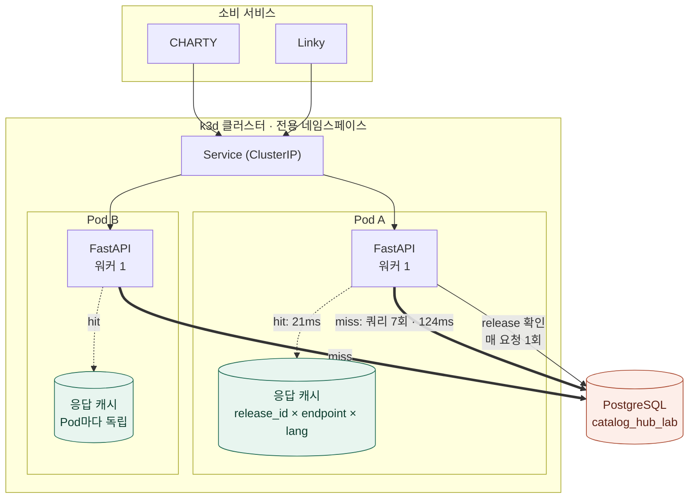

# catalog-hub

조립형 조회의 **응답 캐시** 효과를 재현 가능하게 측정하기 위한 Laughtale 독립 실험
서비스입니다. `LAUGH-KNOWLEDGE-READ-001`(합성 Theme Catalog)의 후속이며, 설계는
`.artifacts/cache-design-rev2.md`와 결정 `.artifacts/cache-decisions-d1-d7.md`가
소유합니다.

> **상태: Step 0–4 한 사이클 완료 (2026-09-12).**
> 결과 요약은 [측정 결과](#측정-결과)에, 전체 기록과 한계는
> `Obsidian/Operations/laughtale/tasks/knowledge-read-optimization.md` revision8이
> 소유합니다.

## 왜 이걸 만들었나

실제 회사 서비스 **Procedure Hub**에 캐싱 도입을 검토하려 했지만, 운영 서비스에서
바로 실험할 수는 없습니다. 그래서 phub의 **구조적 성질만** 가져온 합성 서비스를
Laughtale에 세우고 여기서 측정했습니다.

phub 쪽에서 확인한 조건 (읽기 전용 조회):

- 매 요청 PostgreSQL 조회. `taxonomy.get_full`이 쿼리 7회 + ORM 조립 + i18n + 직렬화
- 워커 1 · 인스턴스 1 (`backend/Dockerfile`에 `--workers` 없음)
- 전체 DB 27MB / 21,264행 — 작다
- 읽기 32 : 실질 쓰기 2 (glossary apply/rollback). terminology 8개는 caller 없는 legacy
- **CHARTY·Linky가 BFF를 우회해 공개 API를 직접 호출** → 프론트 5분 캐시 혜택 없음
- release가 immutable + 동시 published 하나 + 원자적 전환
- `domain-contracts.md:480`에 **cache invalidation hook이 이미 계약으로 존재**

답하려던 질문은 셋입니다.

1. 캐시를 넣으면 응답 지연과 DB 부하가 실제로 줄어드는가
2. 서버를 여러 대로 늘리면 캐시가 갈라지면서 무엇이 깨지는가
3. 그래서 공유 캐시(Redis)가 필요한가

세 번째가 핵심입니다. **필요 없다는 결론도 유효한 답**으로 두고 시작했습니다.

## 아키텍처

측정 대상 경로와, 캐시가 어느 구간을 없애는지를 함께 표시합니다.



요청 하나가 지나는 구간과 캐시가 없애는 범위:

```
                      캐시 없음   캐시 적중
routing                 0.001ms    0.001ms   ← 남음
release_lookup          1.9ms      1.9ms     ← 남음 (D4: 매 요청 DB 조회)
db_query (7회)         87.6ms        —       ← 사라짐
assemble_i18n          12.2ms        —       ← 사라짐
serialize              21.7ms     15.2ms     ← 남음 (D1: 조립 객체를 캐싱)
                      ────────   ────────
                       124ms       21ms
```

**캐시 이득 상한은 `db_query + assemble_i18n` = 99.8ms (81.2%)** 입니다.
나머지 23.6ms는 캐시가 맞아도 남는 고정비입니다.

## 이 서비스가 모델링하는 것과 하지 않는 것

**모델링한 구조적 성질** — 내용이 아니라 형태만 가져왔습니다.

- 27MB급 관계형 원본 (실측 24MB / 69,553행)
- 조립형 조회: 쿼리 다회 + 파이썬 트리 조립 + i18n 치환 + 직렬화
- `release` 개념: 불변이고 동시에 published 하나 (DB 부분 unique 인덱스로 강제)
- 읽기 편중: 쓰기는 release 발행뿐
- 다국어 7종

**하지 않은 것**

- 회사 원자료·스키마·도메인 용어를 읽거나 복제하지 않았습니다. 같은 5433 인스턴스에
  `procedure_hub`가 있지만 열지 않았고, 이 서비스는 `catalog_hub_lab`만 씁니다.
- 값·코드·라벨은 전부 seed 고정 난수 생성물입니다 (`tools/seed.py`).
- phub 운영 적용을 주장하지 않습니다. 이 결과는 "이 조건이라면 이렇게 된다"입니다.

## 확정된 설계 결정 (D1–D7)

| | 결정 | 이 코드에서의 반영 |
|---|---|---|
| **D1** | 캐싱 단위는 **조립된 객체**. 직렬화 JSON은 캐싱하지 않음 | `core/assembled.py`가 캐시 값. 직렬화는 `routers/catalog.py`에서 매 요청 수행 |
| **D2** | 워커 1개 고정 (phub 실제 구성) | `run.py`가 `workers=1` |
| **D3** | "용량 관리 불필요"는 **잠정 가설** → Step 2에서 **확정**(0.548배) | `ResponseCache`에 상한 없음 |
| **D4** | release 전파는 **요청 시점 DB 조회** | `CatalogRepository.current_release()` — 매 요청 쿼리 1회가 **남습니다** |
| **D5** | 계단식 부하 2단 접근 | `tools/loadgen.py`(인프로세스)·`tools/netload.py`(실제 네트워크) |
| **D6** | SLO 판정하지 않고 **관측값만** 보고 | `tools/step0.py`가 PASS/FAIL을 만들지 않음 |
| **D7** | release 전환 빈도는 **민감도 분석**으로 대체 | 전환은 `tools/release_transition.py` |

### D1·D4가 캐시 이득 상한을 정합니다

캐시가 hit해도 **사라지지 않는 구간**이 있습니다.

```
routing        남음  (요청마다 필요)
release_lookup 남음  (D4 — 매 요청 DB 쿼리 1회)
db_query       사라짐 ← 캐시 이득
assemble_i18n  사라짐 ← 캐시 이득
serialize      남음  (D1 — 조립 객체를 캐싱하므로 직렬화는 매번)
```

따라서 **캐시 이득 상한 = `db_query + assemble_i18n`** 이며, 설계서의
"DB 쿼리 N회 → 0회"는 **"N회 → 1회"**가 맞습니다. `tools/step0.py`가 이 상한을
계산해 보고합니다.

## 구성

```
services/catalog-hub/
├── src/catalog_hub/
│   ├── run.py                     실행 진입점 (워커 1 고정)
│   ├── bootstrap/app.py           create_app — 조립 지점
│   ├── bootstrap/lifespan.py      엔진·세션·캐시·표본 버퍼 준비와 정리
│   ├── core/models.py             합성 스키마 (release·category·item·attribute·link·translation)
│   ├── core/assembled.py          조립된 응답 객체 = 캐시 값 (D1)
│   ├── core/response_cache.py     release 키잉 응답 캐시 (Step 0에서는 off)
│   ├── core/catalog_service.py    조회 순서: release → 캐시 → 조립
│   ├── core/stage_timer.py        구간 타이머와 no-op 타이머
│   ├── core/settings.py           설정 (합성 DB만 가리킴)
│   ├── repository/catalog.py      다회 쿼리 + 트리 조립 + i18n 치환
│   ├── routers/                   catalog · stats · health
│   ├── schemas/                   외부 응답 스키마 (직렬화 경계)
│   ├── http/errors.py             공개 오류 변환
│   └── tools/
│       ├── seed.py                합성 데이터 생성
│       ├── step0.py               Step 0 구간 분해
│       ├── loadgen.py             Step 1·2 계단식 부하 (open-loop 도착률)
│       ├── netload.py             Step 3 실제 네트워크 부하
│       ├── podwatch.py            Step 3 Pod별 관측·rolling update
│       ├── release_transition.py  release 전환·되돌리기 (시험·측정 전용)
│       └── cachemem.py            D3 캐시 메모리 · D7 release 전환 민감도
└── tests/
    ├── conftest.py                tests/ 를 import 경로에 추가
    ├── oracle.py                  독립 기대값 (raw asyncpg — 구현 경로 재사용 안 함)
    ├── test_units.py              키잉·캐시·타이머·계획 산술
    ├── test_tools.py              계단·중단조건·하위집단 표본 규칙
    └── test_catalog_api.py        조립 정합성·i18n·캐시·release 전환·격리
```

## 부하 계단 (D5 정정판)

단건이 약 124ms이므로 **단일 워커 이론 상한은 약 8 RPS**입니다. 계단을 이에 맞춰
교체했습니다 (이전 1,2,5,10,20,50,100은 뒤쪽 절반이 무의미했습니다).

```sh
# 거친 탐색 1,2,4,6,8,12 RPS × 30초
uv tool run --from uv==0.12.10 uv run --locked python -m catalog_hub.tools.loadgen --execute --cache off --seconds 30

# 세분화 — 꺾인 계단과 직전 계단 사이 0.5 RPS 간격 × 60초
uv tool run --from uv==0.12.10 uv run --locked python -m catalog_hub.tools.loadgen --execute --cache off \
  --fine --fine-from 6 --fine-to 8 --seconds 60

# D3 캐시 메모리 + D7 release 전환 민감도 (부하 없음)
uv tool run --from uv==0.12.10 uv run --locked python -m catalog_hub.tools.cachemem --execute --probes 20
```

`--execute` 없이는 부하가 발생하지 않습니다. **12 RPS까지 꺾이지 않으면 이론 상한을
넘는 관측이므로 계측·발생기부터 의심**합니다.

하위집단(hit/miss) 지연은 **표본이 20 미만이면 percentile을 내지 않고 "미판정"**으로
남깁니다. 전체 요청 수는 하위집단의 분모가 아닙니다.

## 실행

이 서비스는 **자체 `pyproject.toml` + `uv.lock`을 가진 독립 패키지**입니다. 다른
서비스(`chat`, `platform-mock`)와 같은 방식이며, 이 repo는 uv workspace가 아니라
**서비스마다 환경을 따로 둡니다.**

원본 DB는 기존 5433 `thready-postgres` 인스턴스 안의 `catalog_hub_lab`이며,
**새 PostgreSQL 인스턴스를 띄우지 않습니다** (`/Users/marin/AGENTS.md` 제1원칙).

```sh
cd services/catalog-hub

# 환경 동기화 — lock에 고정된 그대로 설치
uv tool run --from uv==0.12.10 uv sync --locked

# 합성 데이터 — 계획만 보기 / 실제 생성
uv tool run --from uv==0.12.10 uv run --locked python -m catalog_hub.tools.seed --dry-run
uv tool run --from uv==0.12.10 uv run --locked python -m catalog_hub.tools.seed --create-db --execute

# 기능 시험
uv tool run --from uv==0.12.10 uv run --locked pytest -q

# lint · format · 타입
uv tool run --from uv==0.12.10 uv run --locked ruff check src tests
uv tool run --from uv==0.12.10 uv run --locked ruff format --check src tests
uv tool run --from uv==0.12.10 uv run --locked ty check

# Step 0 구간 분해 — 기본은 dry-run
uv tool run --from uv==0.12.10 uv run --locked python -m catalog_hub.tools.step0
uv tool run --from uv==0.12.10 uv run --locked python -m catalog_hub.tools.step0 --execute \
  --requests 200 --warmup 20 --rounds 3 \
  --out ../../.artifacts/catalog-hub/<attempt>/step0.json

# 서버 — 필요할 때만
uv tool run --from uv==0.12.10 uv run --locked python -m catalog_hub.run
```

### 재현 순서

합성 DB는 실험 후 삭제했습니다. `tools/seed.py`가 고정 seed(`20260912`)로 **결정적
재생성**하므로 아래 한 줄이면 복원됩니다.

```sh
uv tool run --from uv==0.12.10 uv run --locked python -m catalog_hub.tools.seed --create-db --execute
```

Step 3(다중 Pod)을 재현하려면 k3d 노드가 DB 네트워크에 닿아야 합니다. Docker Desktop
for macOS에서는 publish된 포트가 VM 안에 바인딩되어 다른 컨테이너의 게이트웨이로
보이지 않으므로, 노드를 DB 네트워크에 연결해야 합니다.

```sh
docker network connect backend_default k3d-laughtale-local-server-0
#   ... 실험 ...
docker network disconnect backend_default k3d-laughtale-local-server-0
```

**연결은 추가일 뿐 기존 연결을 끊지 않습니다.** 같은 노드의 다른 워크로드 경로는
유지됩니다 — 실제로 연결 전후·원복 후 기존 Pod 10개의 이름·상태·재시작 수가
동일함을 대조했습니다. 실험이 끝나면 반드시 `disconnect`로 원복합니다.

## HTTP

| 메서드 | 경로 | 설명 |
|---|---|---|
| `GET` | `/v1/catalog/full?lang=` | 전체 카탈로그 조립 조회 |
| `GET` | `/v1/stats` | 표본 수·캐시 상태 |
| `POST` | `/v1/stats/reset` | 표본 버퍼 비우기 (회차 사이) |
| `GET` | `/health/live` · `/health/ready` | 생존·준비 |

응답 헤더 `X-Server-Total-Ns`(서버 처리 시간), `X-Stage-Timing`(구간별 ns,
타이머 on일 때만), `X-Cache`(hit/miss).

## 어떻게 진행했나

단계마다 **앞 단계 결과가 다음 단계의 조건을 정하게** 했습니다. 특히 판정 기준은
캐시 결과를 보기 전에 고정했습니다 — 결과를 본 뒤 기준을 정하면 원하는 답이 나오게
기준을 고르게 되기 때문입니다.

| 단계 | 한 일 | 나온 것 |
|---|---|---|
| **Step 0** | 캐시 없이 구간 분해. 타이머 비용을 on/off 회차로 보정 | 이득 상한 81.2%, 기준 RSS 124.7 MiB |
| **Step 1** | 계단식 부하로 꺾이는 도착률 탐색 | 7.5–8 RPS에서 p95 급등 |
| **Step 2** | 응답 캐시 도입 후 같은 계단 재측정 + D3 메모리 + D7 민감도 | 48 RPS까지 미꺾임 |
| **Step 3** | k3d 다중 Pod + 실제 네트워크 + rolling update | 전파 지연 0, 오염 0 |
| **Step 4** | 공유 캐시 판단 | **미진행 — 해결할 문제 없음** |

측정 중 스스로 잡은 것 둘:

- **release 전환 시험이 DB를 부풀립니다.** 전환 6회 후 24MB → 106MB
  (translation dead tuple 348,000). 행 수는 같지만 그대로 다음 회차를 돌리면
  크기·배율이 왜곡됩니다. `VACUUM FULL ANALYZE`로 21MB 회수 후 진행했습니다.
- **oracle이 처음엔 2종을 놓쳤습니다.** release 전환을 실제로 일으키는 시험이 없었고,
  `NullStageTimer.report()`가 `{}`를 강제 반환해 `mark` 회귀를 가리고 있었습니다.
  전환 시험 3개를 추가하고 중복 방어를 제거해 둘 다 잡히게 했습니다.

## 측정 결과

### 캐시 효과

| | 캐시 없음 | 캐시 적중 |
|---|---:|---:|
| 단건 응답 | 124 ms | **21 ms** |
| 요청당 DB 쿼리 | 7회 | **1회** (release 확인) |
| 꺾이는 도착률 | 7.5–8 RPS | **48 RPS 이상** (상한 미발견) |

| RPS | 캐시 off p95 | 캐시 on p95 |
|---:|---:|---:|
| 6 | 141.9 ms | 39.4 ms |
| 8 | **246.1 ms (꺾임)** | 43.7 ms |
| 24 | — | 43.4 ms |
| 48 | — | 50.0 ms (여유) |

p99가 p95보다 먼저 무너집니다 (7.5 RPS에서 이미 247.5ms) — 조기 경고 지표로 쓸 수 있습니다.

두 회차의 baseline이 다르므로(off warm-miss 126ms / on warm-hit 31ms) **비율 비교를
쓰지 않고 절대값으로만** 비교했습니다.

### 다중 Pod (Step 3)

| 관측 대상 | 결과 |
|---|---|
| Pod별 캐시 분리 | 확인 — 각 Pod가 독립 miss 1회. hit 3,249 vs 100 |
| **release 전파 지연** | **0요청** — 두 Pod 모두 전환 후 첫 요청부터 새 release |
| **오염** | **0건** — 같은 release_id에 다른 내용 없음 |
| 메모리 N배 | Pod당 89 / 81 MiB. 총량 = Pod당 × N |
| cold warm-up | 신규 Pod 첫 1건만 miss(196.3ms), 이후 320연속 hit |
| rolling update | 구 Pod 0~15.7s → 신 Pod 16.2~75s. 408요청 중 miss 1건, p99 112.6ms, 무중단 |
| 실제 네트워크 | 2.1–3.2 ms (단일 노드 내부 통신) |

전파 지연 0요청은 설계 예측(최대 1요청)보다 좋습니다. D4의 요청 시점 DB 조회가
의도대로 작동했습니다.

### D3 확정 — 전량 상주 유지

| 항목 | 실측 |
|---|---:|
| 캐시 총량 | 13.1 MiB |
| 엔트리당 | 1.87 MiB |
| 원본 DB 대비 | **0.548배** |
| RSS 증가분 | 58.2 MiB (임계 250 미초과) |

배율이 1 미만입니다 — 원본 `payload`가 응답에 없고 i18n은 요청 언어 1종만 담기기
때문입니다. 축소(lang/endpoint 선별) 불필요. 단 **RSS 증가가 캐시 크기보다 크므로
캐시 크기만으로 RSS를 예측하면 안 됩니다.**

### D7 확정 — release 전환 민감도

전환 후 cold 1요청(144ms), 즉시 hit 복귀, p99 영향 1.04배. 7 lang 전량이면 약 7배.
시간당 N회 전환 → 약 `N × 0.88초/시간`으로 **전환 빈도를 몰라도 무시할 수준**입니다.

### 결론 — 공유 캐시(Redis) 미채택

Step 3에서 공유 캐시가 해결할 문제가 **하나도 드러나지 않았습니다**:

```
오염 0 · 전파 지연 0 · 메모리 여유 · cold 비용 1요청 · 48 RPS 미꺾임
```

`release_id`를 캐시 키에 넣은 것이 결정적이었습니다. release가 immutable이고 동시에
published 하나이므로, 전환 시 키 전체가 자연히 무효화됩니다. **TTL·부분 무효화·경합
설계가 전부 불필요하고 stale 자체가 발생하지 않습니다.**

문제가 없는데 도구를 더 얹으면 운영할 것만 늘어납니다. 재검토 조건 4가지는
`.artifacts/catalog-hub/step34-20260912/step4-decision.md`에 기록했습니다.

### 워커 증설과 캐싱의 구분

> **워커 증설은 처리량은 늘리지만 단건 응답 지연과 DB 부하는 개선하지 않습니다.
> 캐싱은 셋 다 개선합니다.**

근거: 단건 124ms→21ms, 쿼리 7회→1회, 꺾임 7.5–8 RPS→48 RPS 이상.
워커를 늘려도 한 요청은 여전히 124ms이고, DB에는 쿼리가 워커 수만큼 더 들어갑니다.

### 재현되지 않은 관측 — 결과에서 제외

1회차에서 32 RPS 꺾임(p95 1187.1ms)이 나왔으나 재현되지 않았습니다. 해당 회차는
`late_starts=56`으로 **발생기가 목표 시각을 놓친 회차**였고, 재현 회차는 같은
32 RPS에서 52.4ms / late 0이었습니다. **재현되지 않은 1회 관측을 상한으로 보고하지
않습니다.** 원인(발생기 단일 asyncio 루프 stall)은 추정이며 단정하지 않습니다.

## 측정 규약

- **구간과 전체를 같은 요청 안에서 쌍으로** 기록합니다. 별도 회차 간 p95 차이로
  타이머 비용을 귀속하지 않습니다.
- **타이머 비용은 on/off 회차 비교로 보정**합니다. `stage_timing_enabled=False`면
  `NullStageTimer`가 들어가 `mark`가 즉시 반환합니다.
- percentile은 raw sample에서 **nearest-rank**로 구합니다. 평균을 percentile이라고
  부르지 않습니다.
- **SLO 판정을 하지 않습니다** (D6). "X RPS에서 p95 급등" 형태의 관측값만 보고하며
  합격/불합격을 쓰지 않습니다.
- **정합성 위반 0은 협상 대상이 아닙니다.** 속도로 상쇄하지 않습니다.
- oracle 검증은 **성능 회차와 분리된 별도 회차**입니다.

## 정합성 검증

`tests/oracle.py`는 서비스의 repository·조립 함수·캐시를 **재사용하지 않습니다.**
같은 DB를 raw asyncpg로 직접 읽어 기대값을 따로 만들므로, 캐시 경로와 직조회 경로가
함께 틀려도 검출됩니다.

주입 결함 검출 확인 (임시 사본에서 수행, 서비스 소스 미변경):

| 주입한 결함 | 검출 |
|---|---|
| i18n 치환 누락 (코드를 라벨로) | 5 |
| 캐시 키에서 `lang` 제거 | 1 |
| 캐시 키에서 `release_id` 고정 | 2 |
| 교차 참조 누락 | 1 |
| 트리 자식 누락 | 6 |
| release 조회가 published를 무시 | 3 |
| 타이머 off인데 구간을 기록 | 3 |

## 한계

- **합성 데이터 실험입니다.** 회사 운영 실적이나 이력서 성과로 소급하지 않습니다.
  phub 운영 적용을 주장하지 않으며, 이 결과는 "이 조건이라면 이렇게 된다"입니다.
- **SLO 판정이 없습니다** (D6). 전부 관측값이며 합격/불합격을 쓰지 않았습니다.
  목표 지연·도착률은 제품 소유자가 정할 값이라 발명하지 않았습니다.
- **워커 1개 조건**의 수치입니다 (D2). phub 실제 구성을 따랐습니다.
- **단일 노드 k3d(4 CPU)** 에서 기존 워크로드 10개와 자원을 공유했습니다
  (노드 메모리 103%). 절대 처리량은 전용 클러스터와 다릅니다.
- **Pod 2개가 같은 노드**에 있어 노드 간 네트워크·스케줄링 효과는 관측 밖입니다.
- **캐시 on 상한 미발견** — 48 RPS까지만 확인했습니다.
- Step 0–2는 **인프로세스 ASGI**였습니다. 그 "서버 밖 구간"은 TestClient 오버헤드이며
  TCP 지연이 아닙니다. 실제 네트워크 왕복은 Step 3에서 별도 Pod·별도 발생기로
  측정했습니다 (2.1–3.2 ms).
- 합성 데이터는 바이트 규모는 맞췄지만 행 분포가 다릅니다 — 24MB/69,553행 대
  phub 27MB/21,264행. 번역 행이 많아 행 수가 약 3배입니다.
- phub 확장 형태는 **K8s 가정**입니다(사용자 결정). 실제 배포는 Azure VM 컨테이너입니다.

## 다음 후보 (미착수)

- 캐시 on 상한 탐색 — 48 RPS 초과 계단
- 노드 분리 환경에서 Pod 간 통신 효과
- **직렬화 JSON 캐싱** — Step 0에서 직렬화가 잔존 23.6ms 중 15.2ms로 지배적입니다.
  D1에서 선제 도입은 배제했지만(응답 계약이 endpoint마다 달라 키가 복잡해짐)
  별도 후보로 검토 가치가 있습니다.

## 관련 문서

| 문서 | 소유 범위 |
|---|---|
| `Obsidian/Operations/laughtale/tasks/knowledge-read-optimization.md` revision8 | 전체 기록·종료 사유·한계 |
| `.artifacts/cache-design-rev2.md` | 설계와 phub 모델링 근거 |
| `.artifacts/cache-decisions-d1-d7.md` | 결정 D1–D7과 그 근거 |
| `.artifacts/catalog-hub/{step0,step12,step34}-20260912/` | raw 측정 결과 |
| [시각화](https://claude.ai/code/artifact/21de2969-473c-48a1-9928-8c9198bfaf3e) | 결과 요약 한 화면 |
