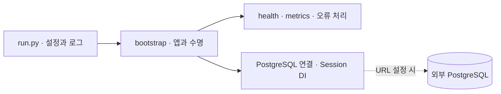
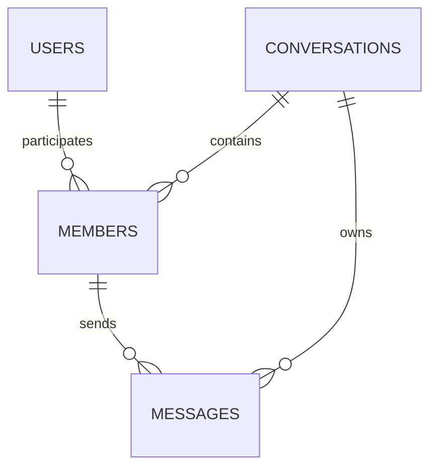

# Chat service

채팅 서비스의 FastAPI 공통 기반입니다. 메시지 저장·WebSocket·인증은 아직 구현하지 않았습니다.

## 출처와 소유권

`external/backend-template/python/fastapi`의 `dd2d3e7cf7cd7f8ee8a264a181fcce5823ed95ae`에서 가져왔습니다.
이 서비스의 수정은 Laughtale이 소유합니다. 원본 업데이트를 자동 덮어쓰거나 런타임 import하지 않습니다.
원본에 재사용 라이선스가 아직 없으며, 이번 복사는 소유자의 명시적 요청으로 진행했습니다. 제3자에게 별도 라이선스 권한을 부여한다는 의미는 아닙니다.

DI·앱 조립·수명·오류·로그·HTTP/DB metrics 기반과 공통 회귀 시험을 가져왔습니다.
인사·예약·상품 seed·SQLite migration은 제품 기능에서 제외했습니다. 공통 HTTP 회귀 시험용 인사 endpoint는 `tests/app.py`에만 있습니다.
SQLite 전용 시험은 PostgreSQL 검증으로 간주하지 않으며 원본에서 유지됩니다.

## 구조


```mermaid
flowchart LR
    RUN[run.py · 설정과 로그] --> APP[bootstrap · 앱과 수명]
    APP --> HTTP[health · metrics · 오류 처리]
    APP --> DB[PostgreSQL 연결 · Session DI]
    DB -. URL 설정 시 .-> PG[(외부 PostgreSQL)]
```

`src/chat_service/`는 실행 코드, `tests/`는 검증입니다. 서버·DB 배포 구성이 아니라 논리적 흐름입니다.
파일 역할은 다음과 같습니다. 업무 계층은 메시지 기능을 구현할 때 추가하며 빈 폴더를 미리 만들지 않습니다.

| 위치 | 책임 |
| --- | --- |
| `bootstrap/` | 앱 조립·시작·종료 |
| `core/`, `contracts/` | 설정·DB 자원·관측 구현과 공통 계약 |
| `domain/chat.py`, `exceptions/chat.py` | 메시지 값·본문 검증·payload 비교와 업무 오류. 아직 API에 연결하지 않았습니다. |
| `models/base.py` | ORM Base·metadata와 선택적으로 사용하는 CreatedAtMixin |
| `models/chat.py`, `migrations/` | SQLAlchemy v2 ORM 매핑과 독립된 Alembic revision. 실제 업무 저장은 후속입니다. |
| `dependencies/`, `routers/` | HTTP DI와 endpoint |
| `services/`, `repositories/` (후속) | 업무·트랜잭션 경계와 저장소 접근 |
| `tests/integration/test_postgres.py` | 실제 PostgreSQL 정상·실패 경로 |
| `../../infra/postgres/` | DB 배포·계정·복제·실험 검증 |

공통 설계 정본은 [Backend Template](../../external/backend-template/design/README.md), 제품 설계는 [채팅 task](../../tasks/linky-chat-internal-dm.md)가 소유합니다.

### 메시지 도메인 초안

`MessagePayload(text)`는 원문을 보존하는 불변 값입니다. 본문은 1~2,000 Unicode code point이며
공백-only·NUL·잘못된 UTF-8을 거절합니다. 길이는 화면의 글자 묶음이나 UTF-8 byte 수가 아닙니다.
`payload_fingerprint()`는 버전과 원문의 digest를 만들고, `ensure_same_payload()`는 버전과 원문을
직접 비교합니다. 같은 키인지 조회하고 권한을 확인하는 작업은 후속 Service/Repository 책임입니다.
이 값과 함수는 DB·HTTP·ORM에 의존하지 않습니다. 실제 저장·중복 방지·방별 순서 보장은 아직 구현하지 않았습니다.

### 채팅 테이블과 migration

매핑은 `User`, `Conversation`, `Member`, `Message` ORM 클래스가 소유합니다. `Mapped`·`mapped_column`을 사용하며 기존 `metadata`는 `Base.metadata`를 가리킵니다. Core 테이블을 별도로 중복 정의하지 않습니다.
`CreatedAtMixin`은 현재 `Message`에만 적용합니다. 기존 DB의 timezone-aware `created_at`과 서버 기본값을 유지하며 `updated_at`은 추가하지 않았습니다. 자동 `relationship`은 없으며 필요한 관계 조회는 후속 Repository에서 명시적으로 작성합니다.
이 선택은 Laughtale의 적용 변경입니다. 고정된 Backend Template의 Core 예제는 수정하지 않습니다. [SQLAlchemy v2 Mixin 기준](https://docs.sqlalchemy.org/en/20/orm/declarative_mixins.html)을 참고했습니다.

아래 네 테이블의 migration을 **격리 테스트 DB에서 검증했습니다**. 개발 DB에는 아직 적용하지 않았습니다.


```mermaid
erDiagram
    USERS ||--o{ MEMBERS : participates
    CONVERSATIONS ||--o{ MEMBERS : contains
    CONVERSATIONS ||--o{ MESSAGES : owns
    MEMBERS ||--o{ MESSAGES : sends
```

UUID PK/FK, 참여자 복합 PK, `(conversation_id, seq)`와 `(conversation_id, sender_id, client_message_id)`의 unique를 둡니다. 발신자·방 복합 FK는 같은 방의 참여자만 참조합니다.
`seq > 0`, `last_seq >= 0`, DM kind, 본문 길이, payload v1·64자리 소문자 hex 형식을 DB에서도 검사합니다.
공백-only 정책·원문/hash 일치·정확히 두 명인 DM·counter와 메시지의 동시 갱신은 이 제약만으로 보장하지 않습니다.
그룹·멤버 탈퇴/삭제·payload 버전 확대는 제약과 업무 정책을 함께 변경해야 합니다. Outbox는 아직 없습니다.

Alembic 1.19.2를 lock에 고정했습니다. 다음 명령은 DB에 접속하지 않고 검토용 SQL만 출력합니다.

```sh
uv tool run --from uv==0.12.10 uv run --locked alembic upgrade head --sql
```

앱 시작은 migration을 실행하지 않습니다. 기본 CLI는 앱 `.env`·`DB_PRIMARY_URL`을 읽지 않으며 별도 `CHAT_MIGRATION_URL`만 허용합니다.
개발용 온라인 경로는 lab Primary의 `chat_migrator`로 연결하고 트랜잭션 안에서 `SET LOCAL ROLE chat_owner`를 수행하도록 구성했습니다. **이 LOGIN 역할·HBA·secret은 아직 마련하지 않았으며 이 경로는 실행 검증 전입니다.** 적용 전에 별도 준비합니다. writer에 DDL 권한을 주지 않습니다.
테스트는 확인한 `chat_test` 연결을 Alembic에 전달하고 자신이 소유한 `run_<uuid>` schema에만 적용·되돌리기를 수행합니다. schema는 시험이 생성·정리하며 migration이 공유 schema를 생성·삭제하지 않습니다.
`downgrade`는 테이블과 데이터를 삭제하므로 일반 운영 복구 명령으로 사용하지 않습니다. 이번 되돌리기는 임시 테스트 schema에서만 검증했습니다.

연결 공유 구현 근거: [Alembic async cookbook](https://alembic.sqlalchemy.org/en/latest/cookbook.html#using-asyncio-with-alembic), 확인일 2026-09-08.
migration은 저장소 checkout 또는 sdist의 `alembic.ini`·`migrations/`로 실행합니다. wheel 단독 설치에는 이 파일을 포함하지 않습니다. sdist에는 [uv source-include](https://docs.astral.sh/uv/reference/settings/#source-include)로 명시적으로 포함합니다.

## 설치·실행

아래 명령은 `services/chat/`에서 실행합니다. 전역 uv는 변경하지 않습니다.

```sh
uv tool run --from uv==0.12.10 uv sync --locked
cp -n .env.example .env
lsof -nP -iTCP:18082 -sTCP:LISTEN
uv tool run --from uv==0.12.10 uv run --locked python -m chat_service.run
```

포트가 사용 중이면 소유 프로세스를 종료하지 말고 `.env`의 `SERVER_PORT`를 변경합니다.
기본 loopback이며 종료는 Ctrl+C입니다. `/`, `/health/live`, `/health/ready`, `/metrics`, `/docs`를 제공합니다.
`DB_PRIMARY_URL`이 비어 있으면 DB 없는 기반 smoke 모드입니다. 채팅이 동작한다는 뜻이 아닙니다.
URL이 있으면 시작 시 연결을 확인하고 종료 시 engine을 해제합니다. readiness는 시작 준비 완료이며 지속적인 DB 건강 검사는 아닙니다.

## PostgreSQL 준비

SQLAlchemy async engine + asyncpg를 사용합니다. URL·계정은 로컬 설정으로 전달합니다.
SQLite URL은 거절하며 PRAGMA·BEGIN IMMEDIATE를 사용하지 않습니다. 각 작업이 `session.begin()`으로 원자적 경계를 소유하고 DI는 자동 commit하지 않습니다.
연결 timeout·pool 획득 timeout·서버 statement/lock timeout은 별도 설정입니다. 값은 초기 개발 기본값이며 성능 검증된 운영 예산이 아닙니다.
URL query 옵션은 현재 거절합니다. TLS·운영 연결 정책은 외부 배포 전에 별도로 설계합니다.

사용자가 승인한 [격리 Primary/Replica 실험 환경](../../infra/postgres/README.md)을 사용합니다. Primary는 loopback 5440, Replica는 5441이며 DB는 둘 다 `laughtale_chat`입니다. 공용 DB는 변경하지 않았습니다.
이 머신의 Git 제외 `.env`에는 Primary의 `chat_writer` URL을 설정했습니다. 다른 checkout에서는 실험 환경의 로컬 비밀번호로 설정합니다. 앱의 읽기 Replica 연결·자동 라우팅은 아직 없습니다.
2026-09-08 실제 Primary에서 앱 lifespan·Session DI 연결/반환과 테스트 전용 DB의 commit·rollback·잠금·취소를 검증했습니다. Replica는 별도 테스트 DB가 아닙니다.
메시지 schema와 Alembic migration은 위 단계에서 테스트 DB 검증까지 완료했습니다. 기반 트랜잭션 시험은 합성 업무이며 실제 채팅 저장 정합성 검증을 대신하지 않습니다.
DB 오류의 업무별 재시도·공개 응답 매핑도 메시지 트랜잭션 도입 시 검증합니다. 임의 자동 재시도는 없습니다.

구현 근거: [SQLAlchemy 비동기 engine](https://docs.sqlalchemy.org/en/20/orm/extensions/asyncio.html), [asyncpg 연결 인자](https://magicstack.github.io/asyncpg/current/api/index.html#asyncpg.connection.connect). 확인일: 2026-09-08.

## 검증

```sh
uv tool run --from uv==0.12.10 uv run --locked ruff check .
uv tool run --from uv==0.12.10 uv run --locked ruff format --check .
uv tool run --from uv==0.12.10 uv run --locked ty check
uv tool run --from uv==0.12.10 uv run --locked pytest -q
uv tool run --from uv==0.12.10 uv build
```

기본 테스트는 공유 DB·개인 `.env`를 사용하지 않습니다. 실제 Uvicorn 종료 시험은 임시 loopback 포트와 자체 생성 프로세스만 사용합니다.
실제 DB 시험은 [테스트 DB 준비](../../infra/postgres/README.md#테스트-db)를 한 번 수행한 뒤 명시적으로 선택합니다.

```sh
uv tool run --from uv==0.12.10 uv run --env-file .env.test --locked pytest -q --postgres
```

2026-09-08: 기본 103개 통과·DB 시험 31개 제외, `--postgres` 실행은 총 134개 통과했습니다. Ruff·포맷·ty·wheel/sdist 빌드도 통과했습니다. DB 시험은 대상 URL과 접속 후 DB/역할/Primary를 확인하고 실행별 schema만 생성·삭제합니다. 개발 DB·Replica·공용 포트를 거절합니다.
commit·본문 실패·commit 실패·취소, pool/lock/statement timeout 후 재사용·계측, 잘못된 인증·연결 불가 시 시작 실패와 engine 해제를 검사합니다. 인증 실패 시험에는 합성 비밀번호를 사용합니다.
pytest 기본 traceback은 짧게 제한합니다. 상세 traceback·`--showlocals`·환경 출력에는 접속 정보가 포함될 수 있으므로 원문을 공유하지 않습니다.
템플릿에서 상속한 Starlette deprecated alias 경고는 숨기지 않고 표시합니다.
도메인 시험 26개와 D2 전용 22개는 본문 정책·payload 비교, migration 왕복·모델 차이 없음·제약 위반·DDL 실패 rollback·잘못된 대상 거절을 검증합니다.
ORM 전환 시험 7개는 매핑·Mixin·실제 객체 저장/조회·서버 기본값·flush 뒤 rollback을 검증합니다. 전환 전후 PostgreSQL CREATE TABLE SQL이 동일하며 기존 0001 revision을 유지했습니다. Alembic 비교에는 서버 기본값 검사도 포함합니다.
DB Docker·복제 smoke는 인프라 안내에서 별도로 검증합니다. K8s 배포·샤딩·Sentry·대규모 부하 시험은 이번 기반 도입에 포함하지 않습니다.
