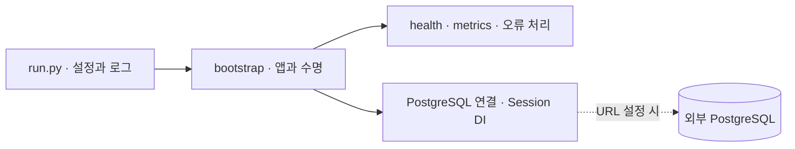
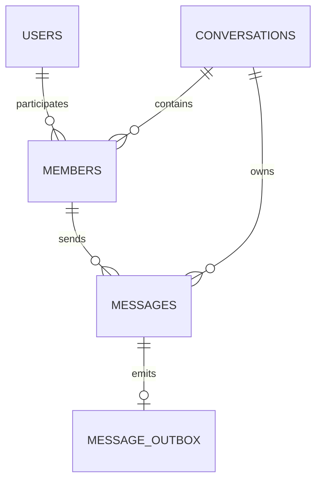

# Chat service

PostgreSQL 메시지 저장·합성 개발 세션·WebSocket을 제공하는 채팅 서비스입니다.
분산 전달의 실행·검증 범위는 [현재 task](../../tasks/linky-chat-internal-dm.md)가 소유합니다.
운영 인증이나 운영 처리량을 보장하는 템플릿은 아닙니다.

## 출처와 소유권

`external/backend-template/python/fastapi`의 `dd2d3e7cf7cd7f8ee8a264a181fcce5823ed95ae`에서 가져왔습니다.
이 서비스의 수정은 Laughtale이 소유합니다. 원본 업데이트를 자동 덮어쓰거나 런타임 import하지 않습니다.
원본에 재사용 라이선스가 아직 없으며, 이번 복사는 소유자의 명시적 요청으로 진행했습니다. 제3자에게 별도 라이선스 권한을 부여한다는 의미는 아닙니다.

DI·앱 조립·수명·오류·로그·HTTP/DB metrics 기반과 공통 회귀 시험을 가져왔습니다.
인사·예약·상품 seed·SQLite migration은 제품 기능에서 제외했습니다. 공통 HTTP 회귀 시험용 인사 endpoint는 `tests/app.py`에만 있습니다.
SQLite 전용 시험은 PostgreSQL 검증으로 간주하지 않으며 원본에서 유지됩니다.

## 구조


```mermaid
flowchart LR
    RUN[run.py · 설정과 로그] --> APP[bootstrap · 앱과 수명]
    APP --> HTTP[health · metrics · 오류 처리]
    APP --> DB[PostgreSQL 연결 · Session DI]
    DB -. URL 설정 시 .-> PG[(외부 PostgreSQL)]
```

`src/chat_service/`는 실행 코드, `tests/`는 검증입니다. 서버·DB 배포 구성이 아니라 논리적 흐름입니다.
파일 역할은 다음과 같습니다.

| 위치 | 책임 |
| --- | --- |
| `bootstrap/` | 앱 조립·시작·종료 |
| `core/`, `contracts/` | 설정·DB 자원·관측 구현과 공통 계약 |
| `domain/chat.py`, `exceptions/chat.py` | 메시지 값·본문 검증·payload 비교와 업무 오류 |
| `models/base.py` | ORM Base·metadata와 선택적으로 사용하는 CreatedAtMixin |
| `models/chat.py`, `migrations/` | SQLAlchemy v2 ORM 매핑과 독립된 Alembic revision입니다. 업무 저장은 repository·service에서 수행합니다. |
| `dependencies/`, `routers/` | HTTP DI와 endpoint |
| `services/`, `repositories/` | 업무·트랜잭션 경계와 저장소 접근 |
| `tests/integration/test_postgres.py` | 실제 PostgreSQL 정상·실패 경로 |
| `../../infra/postgres/` | DB 배포·계정·복제·실험 검증 |

공통 설계 정본은 [Backend Template](../../external/backend-template/design/README.md), 제품 설계는 [채팅 task](../../tasks/linky-chat-internal-dm.md)가 소유합니다.

### 메시지 도메인 초안

`MessagePayload(text)`는 원문을 보존하는 불변 값입니다. 본문은 1~2,000 Unicode code point이며
공백-only·NUL·잘못된 UTF-8을 거절합니다. 길이는 화면의 글자 묶음이나 UTF-8 byte 수가 아닙니다.
`payload_fingerprint()`는 버전과 원문의 digest를 만들고, `ensure_same_payload()`는 버전과 원문을
직접 비교합니다. 같은 키인지 조회하고 권한을 확인하는 작업은 Service/Repository 책임입니다.
이 값과 함수는 DB·HTTP·ORM에 의존하지 않습니다. 저장·중복 방지·방별 seq 할당은 Primary transaction에서 수행합니다.

### 채팅 테이블과 migration

현재 개발 DB revision은 `0002`입니다. 사용자 승인으로 초기 0001·0002에 본문·식별자 길이,
해시 형식, DM 종류·payload version 고정 등 13개 정책 CHECK 제거를 합쳤습니다. 0003은 제거했습니다. 입력 제한은 Domain/wire에서
유지하며, 앱은 미지원 kind를 조회·저장에서 제외하고 미지원 저장 버전을 명시적으로 거절합니다.
과거 본문을 신규 입력 정책으로 다시 생성·검증하지 않고 원문을 비교합니다.
PK/FK/UNIQUE와 seq·counter·발신 상태의 CHECK 9개는 유지합니다. 멤버십 FK는 변경하지 않았습니다.

2026-09-08: 격리 PG 포함 248개 시험, Ruff·포맷·ty·공개 계약 검사를 통과했습니다.
제약 이름을 실제 catalog와 ORM에서 비교하는 시험을 추가했습니다. 기존 개발 DB는 이미 완화된
스키마임을 확인한 뒤 Alembic `stamp --sql 0003:0002`로 revision만 정리했습니다.
이 초기 이력 변경은 현재 로컬 실험에 대한 명시 승인입니다. 다른 기존 DB는 revision 번호만으로
스키마가 같다고 판단하지 않으며, 재사용 시 제약 차이를 검사해야 합니다. stamp는 schema를 바꾸지 않습니다.
0002에서 0001로 downgrade하면 외부 테이블이 삭제되므로 실제 데이터가 있는 환경에서는 실행하지 않습니다.
온라인 migrator LOGIN 경로는 아직 검증하지 않았습니다.

실행 이미지와 replica 수는 [현재 task](../../tasks/linky-chat-internal-dm.md)의 최근 검증 기록을 참고합니다.
이미지 태그는 배포 식별자이며 채팅 확장 로드맵의 완료 단계가 아닙니다.
제약 정리 당시 Primary·Replica revision 0002와 업무 테이블 11개의 행 수·지문을 확인했습니다.
이후 Outbox와 공유 세션을 추가했으며 revision은 0002입니다.

### 내부 Message Outbox

내부 신규 메시지는 `message_outbox`에 같은 event ID와 immutable 이벤트 payload를 함께 저장합니다.
event_id(PK/FK), payload(JSONB), created_at과 Relay의 claim/lease/재시도/published 상태를 저장합니다.
필드 정의는 `models/chat.py`가 소유하며 [독립 Relay](#독립-outbox-relay--격리-실험)가 실제 Kafka로 발행합니다.
이벤트는 기존 `MessageCreated` wire와 호환합니다. Domain/Repository는 HTTP schema에 의존하지 않으며
계약 호환을 시험합니다. 외부 provider 발신 job과 별개입니다.

0001에 신규 테이블 정의를 포함했습니다. 기존 개발 DB에는 공식 Alembic offline SQL에서
`CREATE TABLE chat.message_outbox`만 추출하여 owner transaction으로 적용했습니다. revision은 0002를 유지합니다.
이후 Relay 필드는 기존 개발 DB에 scoped ALTER와 partial index로 추가했습니다.
기존 DB를 다시 사용할 때는 revision뿐 아니라 테이블·열·모델 일치도 검사해야 합니다.
과거 메시지 5건은 backfill하지 않았습니다. 새 writer 전환 후 생성한 메시지부터 Outbox를 기록하며,
과거 메시지의 같은 key 재시도로 이벤트를 새로 만들지 않습니다.

로컬 안전 상한은 미발행 10,000행입니다. 앱의 transaction advisory lock과 COUNT로 직렬화하며
상한 도달 시 신규 저장을 503으로 거절하고 기존 key replay는 유지합니다. 발생기는 이 때 중지해야 합니다.
자동 삭제·가짜 published 처리는 하지 않습니다. 전역 잠금·COUNT 비용이 있는 임시 로컬 정책이며
published 원장은 상한 계산에서 제외합니다. 별도 admission counter와 비교는 후속입니다.

259개 PostgreSQL 포함 회귀, 타입·린트·공개 계약 검사를 통과했습니다.
실제 HTTP 부하에서 저장 ACK 2,213건과 Message/Outbox/Kafka 각 2,213건의 일치를 확인했습니다.
계획 2,625건 중 412건은 발생기 동시 요청 상한으로 미전송되어 전체 목표는 미달입니다.
[부하 실행 안내](../../tests/load/chat-internal/README.md)와 [현재 task의 원시 증거·한계](../../tasks/linky-chat-internal-dm.md#첫-실행-결과)를 참고합니다.
위 부하는 Relay까지의 증거입니다. 분산 전달 결과와 혼합하지 않습니다.

### 공유 세션과 분산 전달

`SESSION_BACKEND=postgres`는 API Pod 사이에 세션을 공유합니다. 원문 쿠키 대신 SHA256을
`chat.shared_sessions`에 저장하고 Primary에서 유효성을 확인합니다. 기본값 `local`은 개발·회귀용입니다.
합성 사용자 발급, 8시간 TTL, 전체 256개 세션 상한은 로컬 실험 정책이며 운영 인증이 아닙니다.
기존 개발 DB에는 신규 테이블만 추가했습니다. 초기 0001 정의에 포함하며 0002는 유지합니다.

독립 실행점은 `python -m chat_service.gateway`, `python -m chat_service.fanout`입니다.
Gateway는 WebSocket·구독·bounded 큐를, Fanout은 Kafka consumer group의 partition 전달을 담당합니다.
Redis는 구독 위치만 관리하며 메시지 broker로 사용하지 않습니다. 메시지 본문 원본은 Primary history입니다.
Gateway의 큐 수락 ACK는 브라우저 수신 ACK가 아닙니다. 이를 구분하기 위해
[별도 실제 수신 시험](../../tests/system/chat-distributed/README.md)을 사용합니다.

실행 환경과 Secret 생성은 [Redis 안내](../../infra/redis/README.md), staged Pod·NetworkPolicy는
[`distributed.yaml`](../../infra/k8s/chat-external/distributed.yaml)에 있습니다.
기본 replica 0인 준비 파일이며 이미 기동한 환경에 재적용하면 내려갑니다. 적용·증설은 명시적으로 수행합니다.
현재는 고정된 로컬 Pod CIDR·포트·합성 인증만 허용하며 인터넷 공개용 Gateway가 아닙니다.

내부 매핑은 `User`, `Conversation`, `Member`, `Message`, `MessageOutbox` ORM 클래스가 소유합니다. `Mapped`·`mapped_column`을 사용하며 기존 `metadata`는 `Base.metadata`를 가리킵니다. Core 테이블을 별도로 중복 정의하지 않습니다.
`CreatedAtMixin`은 `Message`와 `MessageOutbox`에 적용합니다. DB의 timezone-aware `created_at`과 서버 기본값을 유지하며 `updated_at`은 추가하지 않았습니다. 자동 `relationship`은 없으며 필요한 관계 조회는 Repository에서 명시적으로 작성합니다.
이 선택은 Laughtale의 적용 변경입니다. 고정된 Backend Template의 Core 예제는 수정하지 않습니다. [SQLAlchemy v2 Mixin 기준](https://docs.sqlalchemy.org/en/20/orm/declarative_mixins.html)을 참고했습니다.

아래 내부 테이블의 migration을 격리 테스트 DB에서 검증하고 사용자 승인 후 개발 DB에도 적용했습니다.


```mermaid
erDiagram
    USERS ||--o{ MEMBERS : participates
    CONVERSATIONS ||--o{ MEMBERS : contains
    CONVERSATIONS ||--o{ MESSAGES : owns
    MEMBERS ||--o{ MESSAGES : sends
    MESSAGES ||--o| MESSAGE_OUTBOX : emits
```

UUID PK/FK, 참여자 복합 PK, `(conversation_id, seq)`와 `(conversation_id, sender_id, client_message_id)`의 unique를 둡니다. 발신자·방 복합 FK는 같은 방의 참여자만 참조합니다.
DB는 `seq > 0`, `last_seq >= 0`을 검사합니다. kind·본문 길이·payload 버전·해시 입력 정책은 앱에서 검사합니다.
공백-only 정책·원문/hash 일치·정확히 두 명인 DM·counter와 메시지의 동시 갱신은 이 제약만으로 보장하지 않습니다.
그룹·멤버 탈퇴/삭제·payload 버전 확대는 제약과 업무 정책을 함께 검토해야 합니다.

Alembic 1.19.2를 lock에 고정했습니다.

Migration 파일은 `0001_create_chat_tables.py`, `0002_<설명>.py`처럼 네 자리 순번을 앞에 붙여 이름순 정렬합니다.
현재 첫 revision은 `0001`이며 `down_revision = None`입니다. 후속 revision 생성 시 기존 마지막 번호 다음 값을 명시합니다.
Alembic은 순번을 자동 증가시키지 않습니다. 예를 들어 두 번째 파일은 `uv tool run --from uv==0.12.10 uv run --locked alembic revision --rev-id 0002 -m 'describe change'`로 생성합니다.
파일명은 `revision_설명`으로 자동 생성되며 실제 실행 순서는 파일명이 아닌 `down_revision` 연결이 결정합니다. 파일명·revision 순번과 연결 순서의 일치를 기본 시험에서 검사합니다. 분기·병합 migration이 필요해지면 이 단일 순서 규칙을 먼저 재검토합니다.

다음 명령은 DB에 접속하지 않고 검토용 SQL만 출력합니다.

```sh
uv tool run --from uv==0.12.10 uv run --locked alembic upgrade head --sql
```

앱 시작은 migration을 실행하지 않습니다. 기본 CLI는 앱 `.env`·`DB_PRIMARY_URL`을 읽지 않으며 별도 `CHAT_MIGRATION_URL`만 허용합니다.
개발용 온라인 경로는 lab Primary의 `chat_migrator`로 연결하고 트랜잭션 안에서 `SET LOCAL ROLE chat_owner`를 수행하도록 구성했습니다. **이 LOGIN 역할·HBA·secret은 아직 마련하지 않았으며 이 경로는 실행 검증 전입니다.** 적용 전에 별도 준비합니다. writer에 DDL 권한을 주지 않습니다.
테스트는 확인한 `chat_test` 연결을 Alembic에 전달하고 자신이 소유한 `run_<uuid>` schema에만 적용·되돌리기를 수행합니다. schema는 시험이 생성·정리하며 migration이 공유 schema를 생성·삭제하지 않습니다.
`downgrade`는 테이블과 데이터를 삭제하므로 일반 운영 복구 명령으로 사용하지 않습니다. 이번 되돌리기는 임시 테스트 schema에서만 검증했습니다.

연결 공유 구현 근거: [Alembic async cookbook](https://alembic.sqlalchemy.org/en/latest/cookbook.html#using-asyncio-with-alembic), 확인일 2026-09-08.
migration은 저장소 checkout 또는 sdist의 `alembic.ini`·`migrations/`로 실행합니다. wheel 단독 설치에는 이 파일을 포함하지 않습니다. sdist에는 [uv source-include](https://docs.astral.sh/uv/reference/settings/#source-include)로 명시적으로 포함합니다.

## 설치·실행

아래 명령은 `services/chat/`에서 실행합니다. 전역 uv는 변경하지 않습니다.

```sh
uv tool run --from uv==0.12.10 uv sync --locked
cp -n .env.example .env
lsof -nP -iTCP:18082 -sTCP:LISTEN
uv tool run --from uv==0.12.10 uv run --locked python -m chat_service.run
```

포트가 사용 중이면 소유 프로세스를 종료하지 말고 `.env`의 `SERVER_PORT`를 변경합니다.
기본 loopback이며 종료는 Ctrl+C입니다. `/`, `/health/live`, `/health/ready`, `/metrics`, `/docs`를 제공합니다.
`DB_PRIMARY_URL`이 비어 있으면 DB 없는 기반 smoke 모드입니다. 채팅이 동작한다는 뜻이 아닙니다.
URL이 있으면 시작 시 연결을 확인하고 종료 시 engine을 해제합니다. readiness는 시작 준비 완료이며 지속적인 DB 건강 검사는 아닙니다.

## PostgreSQL 준비

SQLAlchemy async engine + asyncpg를 사용합니다. URL·계정은 로컬 설정으로 전달합니다.
SQLite URL은 거절하며 PRAGMA·BEGIN IMMEDIATE를 사용하지 않습니다. 각 작업이 `session.begin()`으로 원자적 경계를 소유하고 DI는 자동 commit하지 않습니다.
연결 timeout·pool 획득 timeout·서버 statement/lock timeout은 별도 설정입니다. 값은 초기 개발 기본값이며 성능 검증된 운영 예산이 아닙니다.
URL query 옵션은 현재 거절합니다. TLS·운영 연결 정책은 외부 배포 전에 별도로 설계합니다.

사용자가 승인한 [격리 Primary/Replica 실험 환경](../../infra/postgres/README.md)을 사용합니다. Primary는 loopback 5440, Replica는 5441이며 DB는 둘 다 `laughtale_chat`입니다. 공용 DB는 변경하지 않았습니다.
이 머신의 Git 제외 `.env`에는 Primary의 `chat_writer` URL을 설정했습니다. 다른 checkout에서는 실험 환경의 로컬 비밀번호로 설정합니다. 앱의 읽기 Replica 연결·자동 라우팅은 아직 없습니다.
2026-09-08 실제 Primary에서 앱 lifespan·Session DI 연결/반환과 테스트 전용 DB의 commit·rollback·잠금·취소를 검증했습니다. Replica는 별도 테스트 DB가 아닙니다.
메시지 schema와 Alembic migration은 테스트 DB 검증과 개발 DB 적용을 완료했습니다. 실제 채팅 저장·전달 검증 결과는 아래 S1 절에서 관리합니다.
DB 오류의 업무별 재시도·공개 응답 매핑도 메시지 트랜잭션 도입 시 검증합니다. 임의 자동 재시도는 없습니다.

구현 근거: [SQLAlchemy 비동기 engine](https://docs.sqlalchemy.org/en/20/orm/extensions/asyncio.html), [asyncpg 연결 인자](https://magicstack.github.io/asyncpg/current/api/index.html#asyncpg.connection.connect). 확인일: 2026-09-08.

## 검증

```sh
uv tool run --from uv==0.12.10 uv run --locked ruff check .
uv tool run --from uv==0.12.10 uv run --locked ruff format --check .
uv tool run --from uv==0.12.10 uv run --locked ty check
uv tool run --from uv==0.12.10 uv run --locked pytest -q
uv tool run --from uv==0.12.10 uv build
```

기본 테스트는 공유 DB·개인 `.env`를 사용하지 않습니다. 실제 Uvicorn 종료 시험은 임시 loopback 포트와 자체 생성 프로세스만 사용합니다.
실제 DB 시험은 [테스트 DB 준비](../../infra/postgres/README.md#테스트-db)를 한 번 수행한 뒤 명시적으로 선택합니다.

```sh
uv tool run --from uv==0.12.10 uv run --env-file .env.test --locked pytest -q --postgres
```

2026-09-08 ORM 기반 단계: 기본 103개 통과·DB 시험 31개 제외, `--postgres` 실행은 총 134개 통과했습니다. Ruff·포맷·ty·wheel/sdist 빌드도 통과했습니다. DB 시험은 대상 URL과 접속 후 DB/역할/Primary를 확인하고 실행별 schema만 생성·삭제합니다. 개발 DB·Replica·공용 포트를 거절합니다. 후속 S1 결과는 아래 절이 소유합니다.
commit·본문 실패·commit 실패·취소, pool/lock/statement timeout 후 재사용·계측, 잘못된 인증·연결 불가 시 시작 실패와 engine 해제를 검사합니다. 인증 실패 시험에는 합성 비밀번호를 사용합니다.
pytest 기본 traceback은 짧게 제한합니다. 상세 traceback·`--showlocals`·환경 출력에는 접속 정보가 포함될 수 있으므로 원문을 공유하지 않습니다.
템플릿에서 상속한 Starlette deprecated alias 경고는 숨기지 않고 표시합니다.
도메인 시험 26개와 D2 전용 22개는 본문 정책·payload 비교, migration 왕복·모델 차이 없음·제약 위반·DDL 실패 rollback·잘못된 대상 거절을 검증합니다.
ORM 전환 시험 7개는 매핑·Mixin·실제 객체 저장/조회·서버 기본값·flush 뒤 rollback을 검증합니다. 전환 전후 PostgreSQL CREATE TABLE SQL이 동일하며 기존 0001 revision을 유지했습니다. Alembic 비교에는 서버 기본값 검사도 포함합니다.
DB Docker·복제 smoke는 인프라 안내에서 별도로 검증합니다. K8s 배포·샤딩·Sentry·대규모 부하 시험은 이번 기반 도입에 포함하지 않습니다.

## 로컬 S1 채팅 API와 WebSocket

로컬 합성 사용자용 HTTP 저장·조회와 단일 프로세스 WebSocket 전달을 구현했습니다.
이 절은 운영 인증·다중 worker 전달·외부 플랫폼 동기화를 뜻하지 않습니다.
`DEV_SESSIONS_ENABLED=true`와 `APP_ENVIRONMENT=local`, `SERVER_HOST=127.0.0.1`을 함께 사용합니다.
기본값은 비활성화이며 비활성 상태에는 채팅 HTTP/WS 라우트가 등록되지 않습니다.
`DEV_ORIGIN` 기본값은 `http://127.0.0.1:18083`이고 명시적 포트의 loopback HTTP Origin만 허용합니다.
BE 기본 포트는 18082입니다. 실행 전 실제 점유를 확인하고 다른 프로세스를 종료하지 않습니다.

개발 DB migration과 아래 seed는 2026-09-08 사용자 승인 후 root가 실행했습니다. 앱 시작 시 DDL·seed가 없습니다.
seed는 기존 행을 덮어쓰지 않으며 명시적인 단일 실행용입니다. 동일 seed의 동시 실행은 지원하지 않습니다.

```sh
DEV_SESSIONS_ENABLED=true uv tool run --from uv==0.12.10 uv run --locked python -m chat_service.seed --apply
DEV_SESSIONS_ENABLED=true uv tool run --from uv==0.12.10 uv run --locked python -m chat_service.run
```

seed는 5440의 `laughtale_chat`/`chat_writer` URL과 실제 Primary identity를 모두 검사한 뒤
합성 사용자 `user_a`·`user_b`와 고정 DM을 만듭니다. 정확한 UUID는 `core/sessions.py`와 fixture가 소유합니다.
최초 적용은 빈 `chat` schema를 확인한 뒤 Alembic의 `upgrade head --sql` 산출물을 기존 컨테이너의
관리자 로컬 소켓으로 실행했습니다. DDL은 SQL 내부의 `SET LOCAL ROLE chat_owner`와 단일 트랜잭션으로
수행했으며 writer의 DDL 권한이나 새 LOGIN·HBA·secret을 추가하지 않았습니다.
이는 온라인 `chat_migrator` 경로 검증이 아닙니다. 이후 migration에 최초 설치용 offline SQL을 재사용하지 않으며,
현재 revision을 확인하고 명시적인 revision 범위 또는 준비된 온라인 경로를 사용합니다.

`POST /v1/dev/session`, `GET /v1/session`, `GET /v1/internal-conversations`,
`POST/GET /v1/internal-conversations/{conversation_id}/messages`, `WS /v1/ws`를 제공합니다.
서버 actor만 sender를 결정하며 extra 입력은 거절합니다. 새로운 저장은 201, 같은 키·본문은 200,
같은 키의 다른 본문은 409입니다. ACK는 transaction commit 뒤에 반환합니다.
counter와 메시지를 동일 Primary 트랜잭션에서 방 행 잠금으로 저장하며, rollback은 seq를 소비하지 않습니다.
history는 권한·snapshot 경계와 연속 seq를 검사하고 삭제 없는 S1을 전제로 합니다.
방 목록의 상대 이름 조회는 현재 고정 seed DM 규모의 단순 조회이며 대규모 목록 최적화를 주장하지 않습니다.

세션 cookie는 HttpOnly·SameSite=Strict·8시간 만료이며 최대 256개입니다. 재선택은 기존 cookie를 폐기하고,
포화 시 오래된 세션부터 폐기합니다. 재시작하면 모두 만료됩니다. 별도의 브라우저 context로 두 사용자를 사용합니다.
정확한 Host/Origin·직접 loopback peer를 확인하며 Forwarded/X-Forwarded-*를 신뢰하지 않습니다.
Uvicorn의 proxy header 해석도 끕니다. HTTP 변경 요청은 Origin 필수, 모든 채팅 응답은 no-store입니다.
쿠키·메시지·DB 비밀번호를 로그나 metric label에 넣지 않습니다.

WS는 128 연결, 연결당 16 구독, 송신 큐 64 frame·256KiB, 개별 입력 16KiB, 송신 timeout 5초입니다.
HTTP POST 본문도 16KiB·수신 5초로 제한하고 DB 업무 전체 예산은 10초이며 DB pool/lock/statement 제한도 유지합니다.
Uvicorn `websockets-sansio`가 frame 크기와 읽기 backpressure를 적용합니다. 과부하 송신 큐는 1013으로 종료해 복구를 유도합니다.
성공 구독 이전에 도착하는 이벤트도 FE가 buffer/history와 병합해야 합니다. unsubscribe에는 ACK frame이 없습니다.
등록 뒤 Primary head를 읽고, Gateway 공용 루프가 10초 ±10% jitter마다 활성 방의 membership/head를 한 번에 조회합니다.
마지막 이벤트 유실도 다음 권위 head로 발견하며 실패 3회 연속이면 연결을 종료합니다. 실패 head를 0으로 반환하지 않습니다.
세션 교체·만료는 다음 송신/입력 또는 공용 주기 검사에서 기존 socket을 1008로 종료합니다.
저장 후 전달 실패는 commit을 되돌리지 않으며 ACK와 history가 원본입니다.

제공자 계약은 Python 모델과 실제 라우트에서 생성합니다. 수동 이중 정의하지 않습니다.

```sh
uv tool run --from uv==0.12.10 uv run --locked python -m chat_service.export_contracts
uv tool run --from uv==0.12.10 uv run --locked python -m chat_service.export_contracts --check
```

산출물은 `contracts/chat/openapi.json`, `ws-client.schema.json`, `ws-server.schema.json`, `fixtures.json`입니다.
seq/cursor는 PostgreSQL bigint 범위의 십진 문자열이며 message seq는 1부터, head/cursor는 0부터입니다.
입력 원문은 정규화하지 않고 UTC 시각으로 직렬화합니다.

2026-09-08 S1 최종 검증: 기본 135개 통과·PostgreSQL 44개 제외, 명시적 `--postgres` 실행은
179개 통과했습니다. Ruff 검사·포맷 검사(79개 파일)·ty·계약 생성 차이 검사·wheel/sdist 빌드가 통과했습니다.
기존 Starlette alias 경고 1건은 유지합니다. 두 세션 HTTP/WS, ACK·event·history 표현 일치,
새 저장·재전송·충돌·권한·snapshot, 동시 writer·rollback·취소와 seq 재사용을 확인했습니다.
마지막 이벤트 하나를 유실시킨 뒤 추가 메시지 없이 권위 head/history로 복구했고,
같은 방의 두 peer가 한 SQL batch로 head를 조회하는 것을 계수했습니다.
실제 Uvicorn sansio upgrade·저장·수신은 임시 loopback socket과 실행별 테스트 schema로 검사하고 종료했습니다.
본문 크기·수신 timeout·disconnect·취소, 세션 교체/만료, 큐 count/byte 제한도 검증했습니다.
후속 로컬 통합 검증에서는 개발 DB `0001`, 합성 사용자 2명·DM 1개를 적용하고 BE 18082·FE 18083을 기동했습니다.
Orca의 격리 프로필 두 개에서 양방향 송수신, 한쪽 페이지 이탈 중 저장 후 재접속 복구,
페이지 재로딩 후 내역 유지를 확인했습니다. 메시지 3건의 seq는 1–3이고 양쪽 화면·Primary·Replica에서 일치했습니다.
이는 소규모 수동 브라우저 검증이며 서버 재시작·무중단 배포·부하·HA·동적 멤버십 변경의 검증은 아닙니다.

## 외부 플랫폼 모의 연동

외부 계정 없이 공통 mock 계약으로 수신·답장합니다. 실제 Telegram 등 provider API의 호환성을 뜻하지 않습니다.
Wire 계약은 [platform-simulator](../../contracts/platform-simulator/README.md), 계획·통합 증거는
[외부 플랫폼 task](../../tasks/chat-external-platforms.md)가 소유합니다.

`EXTERNAL_ENABLED=true`는 기존 합성 세션과 명시적 DB를 요구합니다. 제어 Bearer·외부 발신 Bearer·
연결별 수신 Bearer를 분리하고 최소 16자로 설정합니다. 연결별 UUID/profile/token 매핑은
`EXTERNAL_CONNECTION_CREDENTIALS` 설정이며 secret은 DB·Git·로그에 저장하지 않습니다.
`.env.example`은 필드만 안내하며 실제 자격증명은 포함하지 않습니다. 인프라별 네트워크 허용 범위는
`Settings`와 `LocalChatSecurity`의 명시적 검증이 소유합니다.

| 경로 | 권한·완료 의미 |
| --- | --- |
| `POST /v1/dev/external-connections` | 별도 제어 Bearer로 합성 연결·방·상담사 멤버십을 준비합니다. 설정된 connection/profile만 허용합니다. |
| `POST /v1/external-events` | 연결별 Bearer로 수신합니다. 새 저장 201·동일 replay 200·다른 내용 충돌 409입니다. |
| `GET /v1/external-conversations` | 세션 상담사가 접근 가능한 방 목록입니다. 1,000개 초과는 조용히 잘라내지 않고 실패합니다. |
| `GET/POST /v1/external-conversations/{id}/messages` | 기존 형태의 snapshot 페이지 조회와 멱등 답장 접수입니다. |
| `GET /v1/external-conversations/{id}/messages/{message_id}` | 접근 가능한 메시지의 최신 발신 상태·외부 effect ID를 확인합니다. |
| `/v1/external-ws` | 최초 subscribe 한 개에 대해 즉시 head와 이후 약 1초 간격의 DB head를 알립니다. |

외부 참가자는 기존 내부 `User`와 섞지 않습니다. `0002`의 외부 전용 7개 테이블과 DB FK·고유 제약으로
계정/대화/참여자 범위를 보호합니다. 내부 DM schema는 유지합니다. 수신 이벤트와 메시지의 중복 키를
분리하며, 외부 발생 시각·수신 시각·저장 순서를 별도로 보관합니다. 메시지 seq는 **Chat 저장 순서**입니다.

답장 메시지와 발신 원장은 같은 Primary transaction으로 커밋합니다. worker는 설정된
`EXTERNAL_CONNECTION_CREDENTIALS`의 연결 UUID에 속한 작업만 claim합니다. 빈 집합은 실행할 작업이
없다는 뜻이며 전체 원장 접근으로 해석하지 않습니다. 같은 DB를 사용하는 로컬/K8s 실행의 다른
연결·Mock 대상 작업을 가져가지 않으며, 만료된 sending 작업 복구에도 동일 scope를 적용합니다.
외부 목록·내역·단건 조회·답장·WebSocket 권한도 동일 runtime 연결 scope를 사용합니다. 같은 상담사가
과거 실행의 방 멤버이더라도 현재 설정에 없는 연결의 방은 목록에서 제외하며 조회/답장은 404,
WS 구독은 1008로 거절합니다. 내부 DM 권한은 변경하지 않습니다.
앱 lifespan worker가 원장을
읽어 DB transaction 밖에서 mock HTTP를 호출합니다. `pending/sending/accepted/rejected/unknown`을
구분하며 accepted는 외부 접수이지 상대 읽음이 아닙니다. 발신 2초·lease 15초·최대 3시도·30초 예산,
재시도 backoff/jitter와 오래된 lease 결과의 조건부 갱신을 사용합니다. 종료 취소는 sending lease를
보존하여 재개 시 결과 불명으로 취급합니다. 응답 유실 후 멱등·조회 능력이 없으면 자동 재발송하지 않습니다.

조회 지원만 있고 멱등 발신을 지원하지 않는 경우에는 timeout 직후 조회를 한 번 시도합니다.
그때 효과가 없거나 조회가 실패하면 `unknown`을 보존하며 자동 재발송하지 않습니다. 이후 provider에서
효과가 뒤늦게 생성되어도 현재 worker는 다시 조회하지 않으므로 `unknown`이 유지됩니다. 미접수나
전송 실패로 확정한 상태가 아니며, 제한된 후속 대사/수동 확인 경로는 아직 구현하지 않았습니다.
이 제약은 격리 PostgreSQL과 완료 시점을 제어한 provider 대역에서 효과 1건·재발송 0회로 검증합니다.

lease 결과 반영은 job 상태와 claim token의 조건부 갱신으로 이전 worker가 새 owner의 결과를
덮어쓰지 못하게 합니다. 만료 비교에 애플리케이션이 전달한 시각을 사용하므로, 그 시각을 얻은 뒤
DB 잠금/실행이 지연되면 token이 바뀌지 않은 결과가 실제 만료 시각 이후에 반영될 수 있습니다.
DB 실행 순간의 엄격한 만료 판정이나 외부 효과 자체의 fencing을 보장하지 않습니다.

외부 WebSocket은 별도 endpoint로 기존 내부 hub를 변경하지 않습니다. 연결당 구독 하나·128개 연결
상한·송신 5초 제한을 두고 tick마다 세션·멤버십을 확인합니다. queue 대신 최신 head를 조회하므로
중간 head 알림의 생략은 가능하며 FE가 HTTP cursor로 내역을 복구합니다. 연결마다 초당 약 1회 Primary
조회가 발생합니다. 채널·방의 이벤트를 즉시 push하는 broker 기반 fan-out 구현은 아닙니다.

2026-09-08 외부 BE 검증: 전체 `--postgres` 217개 통과, 기존 Starlette 경고 1건, Ruff·ty·wheel/sdist
빌드 통과입니다. 교차 계정 FK·상담사 권한·수신 및 발신 병렬 중복·seq·내부 DM 보존 downgrade,
HTTP 수신/답장·WS head·상태 조회, 모의 전송 실패·응답 유실·취소/재개·lease fencing·worker 경합을
격리 PostgreSQL과 통신 대역으로 검증했습니다. 실서비스 provider, 외부 접수의 방별 엄격한 순서,
운영 인증, 대용량, K8s 배포 성공을 이 결과로 주장하지 않습니다.

### 격리 K8s 실험의 네트워크 예외

기본 `NETWORK_PROFILE=local`은 기존 loopback 경계를 유지합니다. `isolated-lab`은
`APP_ENVIRONMENT=isolated-lab`, `SERVER_HOST=0.0.0.0`, `SERVER_PORT=18082`를 함께 지정해야 합니다.
이때만 mock URL의 `platform-mock` DNS를 허용합니다. 기본 로컬 mock 주소는
`http://127.0.0.1:18087`입니다.

추가 수신 허용은 **machine 경로 두 개**(`/v1/external-events`, `/v1/dev/external-connections`)에만
적용됩니다. 직접 연결의 source IP가 `10.42.0.0/24`이고 Host가 정확히 `chat:18082`여야 하며,
Origin과 모든 Forwarded/X-Forwarded 헤더를 거절합니다. 연결별/제어 Bearer 검사는 그대로 필요합니다.
단일 node 전용 실험 CIDR이며 다른 cluster나 인터넷 공개 환경의 일반 설정이 아닙니다.

브라우저 세션·내역·WebSocket은 여전히 직접 loopback과 기존 Origin 경계만 허용합니다.
Pod별 포트 포워딩으로 사용하는 합성 세션은 프로세스 메모리에 있으므로 공유 로그인이나 운영 인증이
아닙니다. health/metrics 접근 격리는 인프라 manifest의 별도 책임이며 여기서 보장하지 않습니다.
모든 실험 secret은 공백·제어 문자 없는 ASCII 16–256자로 제한하고 서로 다른 값을 요구합니다.
## 독립 Outbox Relay — 격리 실험

`python -m chat_service.relay`는 API와 별도 프로세스로 실행합니다. `aiokafka==0.14.0`을 사용하며
`APP_ENVIRONMENT=isolated-lab`, `NETWORK_PROFILE=isolated-lab`, 전용 Primary의
`DB_PRIMARY_URL`, `KAFKA_BOOTSTRAP_SERVERS=kafka:9092`를 명시합니다.
Mac 직접 시험에만 `127.0.0.1:19092`를 허용합니다. plaintext는 격리 실험 한정입니다.

미발행 방별 최소 seq를 DB에서 claim한 뒤 transaction 밖에서 발행합니다. lease는 30초이며,
발행 예산은 10초, SDK 종료 예산은 추가 3초입니다. ACK 뒤 유효 lease/token CAS가 성공해야
`published_at`을 기록합니다. 실패는 0.5–10초 jitter backoff로 재시도하며 원장을 삭제하지 않습니다.
취소는 lease를 보존합니다. 종료에 응답하지 않는 producer는 프로세스를 종료하여 격리하고,
SIGTERM/SIGINT에는 최대 15초 watchdog을 둡니다. 로그는 고정 outcome 코드만 남깁니다.

Kafka key는 conversation UUID 문자열, event ID는 message UUID입니다. producer idempotence는
서로 다른 프로세스/Outbox 재발행의 중복을 제거하지 않습니다. ACK와 DB 완료 사이 종료,
오래된 producer의 늦은 발행은 중복·역순을 만들 수 있으므로 소비자가 ID/seq로 복구해야 합니다.
RF=1 broker는 고가용성이 아닙니다. 발행 불가능한 이벤트는 해당 방의 다음 seq를 막으며
운영자가 원인을 확인해야 합니다. 자동 폐기·DLQ 성공 처리는 하지 않습니다.

미발행 10,000건 admission은 전역 advisory transaction lock 아래 count로 제한합니다.
이미 published인 원장은 admission에서 제외하지만 삭제하지 않으므로 디스크 상한은 별도 감시합니다.
이 전역 경합과 단일 in-flight Relay는 학습용 최소 구현이며 대규모 처리량을 증명하지 않습니다.
상세 backlog와 지연은 독립 DB/Kafka 검증기가 관측하며 전용 metrics exporter는 아직 추가하지 않습니다.
