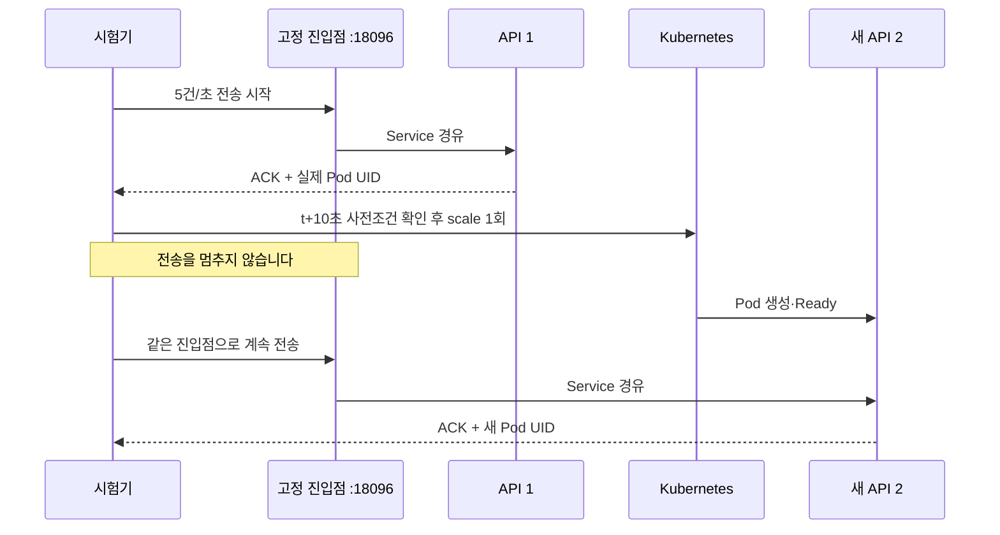

# E1: API 1 → 2 전환 시험

한 합성 사용자(`user_a`)와 한 DM 방에 목표 5건/초로 40초 동안 최대 200건을 전송합니다.
같은 진입점이 API Service를 경유하고, 두 고정 Gateway의 WS 수신을 독립 대조합니다.
다중 사용자·방 증가나 최대 처리량을 증명하는 시험은 아닙니다.



## 실행 조건과 명령

root 담당자가 초기 API 1개, Gateway 2개, Fanout 2개, Relay 1개, `chat-growth-proxy` 1개를 준비합니다.
모두 Ready·재시작 0이어야 합니다. PostgreSQL Primary/Replica, Kafka, Redis, k3d 컨테이너는 실행 중이어야 합니다.
기존 Pod와 컨테이너의 정체는 고정하며 **새 API UID 1개만** 허용합니다.

```bash
services/chat/.venv/bin/python tests/system/chat-distributed/growth.py --allow-api-scale --run-dir .artifacts/chat-distributed/growth-e1-a
python3 -m unittest discover -s tests/system/chat-distributed -p 'test_growth.py'
```

`--allow-api-scale` 없이는 실행하지 않습니다. 기존 run 디렉터리를 덮어쓰지 않습니다.
별도 클러스터·Deployment·DB를 생성하거나 기존 데이터를 삭제하지 않습니다.
기존 API Deployment의 증설로 새 Pod 1개는 생성합니다.
명령이 시작되면 다음 **한 번의 변경**이 허용됩니다.

```text
kubectl --context k3d-laughtale-local -n laughtale-chat-external scale deployment/chat --replicas=2 --current-replicas=1 --resource-version=<직전 조회값>
```

사전 권한·replica 수·Deployment UID·resourceVersion을 확인합니다. 각 kubectl 명령은 5초 timeout이며,
증설 직전 조건이 바뀌면 실패합니다. Ready 대기는 비동기 조회로 수행하므로 메시지 전송을 차단하지 않습니다.
실패·STOP·timeout이면 새 전송을 중단하며 **scale 재시도·자동 축소·롤백·데이터 삭제를 하지 않습니다**.
변경 결과가 불명이면 root가 실제 상태를 확인해야 합니다.

세션 발급만 API 직접 포워딩 `18092`를 사용합니다. 조회와 메시지 전송은 항상 `18096`을 사용하며
Host도 `127.0.0.1:18096`입니다. Origin은 `http://127.0.0.1:18083`, WS는 기존 `18094/18095`입니다.
Ingress 내부 인증 값은 프록시가 붙이며 시험기에는 전달하지 않습니다.

## 안전 상한과 증거

- 전체 시험 예산 120초, 전송 200건, WS 2개, 각 수신 queue·증거 256개입니다.
- 애플리케이션 HTTP는 고정 흐름상 최대 204회로 1,000회 예산 아래입니다. 요청 timeout은 3초입니다.
- 최초·중간·마지막 자원 표본과 DB metrics 가용성을 검사합니다. 자원 기준은 기존 실험과 동일하며 전환 중 새 API의 Pending 상태만 일시 허용합니다.
- 호스트 free 10% 미만, k3d 메모리 85% 초과, 의존 컨테이너 95% 초과, Kafka 데이터 3GiB 이상, 정체 변경·재시작·기존 Pod 미준비 상태는 STOP 대상입니다.
- 동기식 CLI 호출은 background thread 또는 비동기 subprocess에서 수행합니다. 자원 샘플은 5초 대기 후 수집하므로 수집 시간이 간격에 추가됩니다.

`manifest.json`은 최초 전송 계획, `requests.jsonl`은 요청별 처리 UID·시각·ACK·hash,
`receipts.jsonl`은 Gateway별 수신 증거입니다. 쿠키와 메시지 원문은 저장하지 않습니다.
`scale-request.json`/`scale-result.json`은 실제 변경 명령 시각·사전조건·결과이며,
`resources.jsonl`은 Pod UID·Ready 전환 시각·컨테이너 정체·자원 표본입니다.
`evidence.json`은 전체 정규화 증거이고 `result.json`은 증설 전/진행 중/Ready 이후 통계와 독립 판정입니다.
Ready 시각은 Kubernetes condition timestamp이며, 요청 시각과의 비교에는 호스트·클러스터 시계 오차가 포함됩니다.
요청 간 최대 간격과 생성 지연을 함께 기록하므로 목표 5건/초를 무조건 달성한 것으로 해석하지 않습니다.
E1-c부터 전체 요청 시작 간격과 최대 생성 지연은 각각 **1초 이하**여야 합니다. phase 경계도
포함하며 `manifest.json`의 고정 실험 예산과 `result.json`의 `continuity`에 기록합니다.
이는 시험 트래픽 연속성 예산이며 애플리케이션 응답 latency SLO가 아닙니다.
독립 판정기는 최초·명령 직전 Deployment UID 일치, 명령에 사용한 resourceVersion과 직전 조회값의
정확한 일치, 증설 요청·완료·Ready 관찰 시각 순서, 초기 고정 Pod 수, 양 Gateway의 서로 다른
수신 경로도 검사합니다. 이전 E1-a/b 증거·결과는 수정하지 않고 보존합니다.

`final.json`은 기존 DB/outbox/Kafka `verify.py` 입력과 호환됩니다. relay 처리 뒤 root가 별도 실행하여
저장·outbox·Kafka 증거를 대조합니다. E1 통과는 기존 API와 새 Ready API가 **둘 다 실제 ACK를 처리**하고,
모든 ACK가 두 WS에서 동일 ID·seq·본문 hash로 수신된 경우에만 가능합니다.
HTTP 결과 불명·누락·중복·본문 변경·UID 위조/누락·추가 Pod·예상 밖 재시작은 실패합니다.
