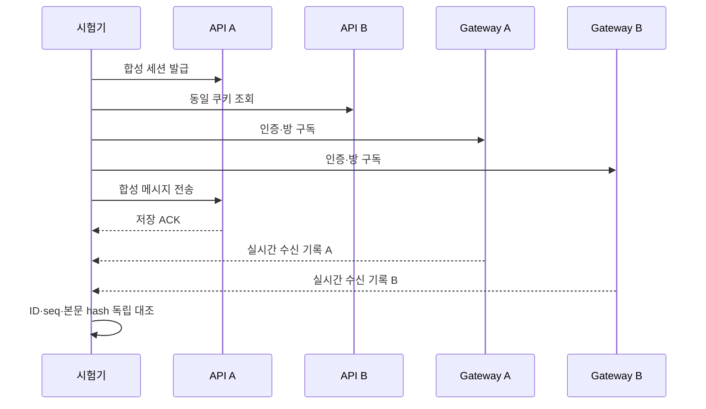

# Distributed chat evidence

사용 중 API 1→2 전환 시험은 [GROWTH.md](GROWTH.md)를 봅니다. 아래 고정 배치 시험과 별도입니다.

합성 DM을 두 API와 두 Gateway에 나누어 전송·수신합니다. 실제 실행은 승인된 로컬 실험 환경에서만 수행합니다.
애플리케이션 serializer를 가져오지 않는 독립 비교기를 사용합니다. 대용량 성능이나 운영 인증을 증명하는 시험은 아닙니다.



## 실행

저장소 루트에서 기존 chat 환경의 Python을 사용합니다. 새 패키지를 설치하지 않습니다.
기동·DB seed·포트 포워딩은 이 도구가 수행하지 않습니다.

```bash
services/chat/.venv/bin/python tests/system/chat-distributed/runner.py --scenario smoke --run-dir .artifacts/chat-distributed/smoke-a
services/chat/.venv/bin/python tests/system/chat-distributed/runner.py --scenario smoke --resource-guard --run-dir .artifacts/chat-distributed/guarded-smoke-a
services/chat/.venv/bin/python tests/system/chat-distributed/runner.py --scenario bounded --run-dir .artifacts/chat-distributed/bounded-a
services/chat/.venv/bin/python tests/system/chat-distributed/runner.py --scenario reconnect --run-dir .artifacts/chat-distributed/reconnect-a
python3 -m unittest discover -s tests/system/chat-distributed -p 'test_*.py'
```

| 시나리오 | 전송·수신자 | 검증 |
| --- | --- | --- |
| smoke | 20건, 목표 5건/초, WS 2개 | 공유 세션·양 Gateway 실시간 수신·익명 거부·재로그인 폐기 |
| bounded | 100건, 목표 10건/초, WS 20개 | Gateway마다 10개 연결, 메시지별 20개 수신 기록 대조 |
| reconnect | 20건, 목표 5건/초, WS 2개 | B 연결 중단 중 5건 전송, 재구독·고정 snapshot history 병합 |

HTTP는 요청별 timeout 3초, 전체 시험 120초, HTTP 요청 최대 200회입니다.
요청은 순차적으로 시작하며 느려진 요청을 무한 병렬 적재하지 않습니다. 따라서 목표 전송률은 보장된 open-loop 부하가 아니며 `generator_lag_seconds`와 실제 원장을 함께 판단합니다.
WS frame은 16KiB, 연결별 수신 queue·증거는 최대 256개입니다. 실행 중 해당 run 디렉터리에 `STOP` 파일을 두면 다음 전송 전 중단합니다.
원장 디렉터리는 저장소 `.artifacts/` 아래 새 경로만 허용하며 기존 결과를 덮어쓰지 않습니다.

`--resource-guard`는 기존 `tests/load/chat-internal/resources.py`의 `sample(distributed=True)`를 사용합니다.
첫 리소스 샘플이 정상이어야 HTTP를 시작하며, 이후 5초 간격(샘플 소요 시간 별도)과 종료 시 샘플을 수집합니다.
컨테이너·Pod 정체 변경, 자원 임계치 초과 또는 수집 오류는 `resources.jsonl`에 기록하고 `STOP`을 생성합니다.
명령 자체는 인프라를 기동하거나 수정하지 않습니다. 전체 120초 예산을 소진하면 최종 샘플이 완료되지 않을 수 있으며 통과시키지 않습니다.

네트워크 목적지는 API `127.0.0.1:18092/18093`, Gateway `127.0.0.1:18094/18095`로 고정합니다.
HTTP/WS Host는 `127.0.0.1:18082`, Origin은 `http://127.0.0.1:18083`입니다. 환경 proxy와 redirect를 사용하지 않습니다.
실제 Pod 식별·배포 상태 증거는 운영 담당자가 별도로 수집합니다. 포트가 다르다는 사실만으로 서로 다른 Pod임을 주장하지 않습니다.

## 증거와 판정

- `manifest.json`: 전송 전에 고정한 합성 요청 ID·본문 hash입니다.
- `requests.jsonl`, `receipts.jsonl`: 완료된 각 HTTP 요청과 각 WS 수신을 즉시 기록합니다. 쿠키·원문 본문은 기록하지 않습니다.
- `evidence.json`: 연결별 최초 head·수신·history 복구·재로그인 폐기 관찰입니다.
- `result.json`: 독립 비교 결과입니다. 실시간 누락을 history 성공으로 통과시키지 않습니다.
- `final.json`: 기존 `tests/load/chat-internal/verify.py`가 읽는 원장 형식입니다. 필요한 경우 relay가 처리된 뒤 **별도 실행**하여 DB/outbox/Kafka 증거를 대조합니다. 이 시험 자체가 DB를 직접 검사한 것은 아닙니다.

재접속은 중단 직전 수신 cursor부터 고정 snapshot까지 history seq가 연속인지 검사합니다.
재연결 전에 A가 중단 구간 5건을 모두 수신해야 하며, 수신 대기 timeout은 명시 실패입니다.
`history_rows`는 조회·대조한 건수, `history_recovered`는 WS에서 관찰되지 않아 history로만 복구한 건수,
`history_overlap_ws`는 두 경로에서 겹친 건수입니다. 이번 reconnect 시험은 중단 구간 전체가
history에 의존했음을 요구합니다. 늦은 WS 전달로 모두 겹쳤다면 제품 누락은 아니지만 이 복구 증명의 통과로 처리하지 않습니다.
전송 결과 불명은 `unknown`으로 남기며 자동 재전송하거나 실패를 정상 ACK로 바꾸지 않습니다.
중복 WS event·본문/방/발신자/seq 변경·누락·인증 검사 누락은 실패합니다.
재로그인 후 유휴 연결 폐기는 최대 7초 관찰하고 측정 시간을 남깁니다(5초 검사 주기와 통신 시간을 포함한 시험 예산).
`final.json`과 `result.json`의 `revocation.peers[].elapsed_ms`는 재로그인 요청 시작부터 각 WS 종료까지의 측정값입니다.
`design_5s_met`는 별도의 5초 충족 판정입니다. 7초 이내 종료 관찰을 5초 보장으로 해석하지 않습니다.
세션 8시간 자연 만료, 실제 Gateway/consumer 재시작, Kafka 중복 주입은 이 명령의 검증 범위가 아닙니다.
